Using the Virtual Environment in VSCode and Jupyter
---------------------------------------------------

Install ``ipykernel`` in the activated virtual environment before using it in a notebook:

.. code-block:: console

  pip install ipykernel

VSCode
^^^^^^

Open the project folder containing ``.venv`` in VSCode:

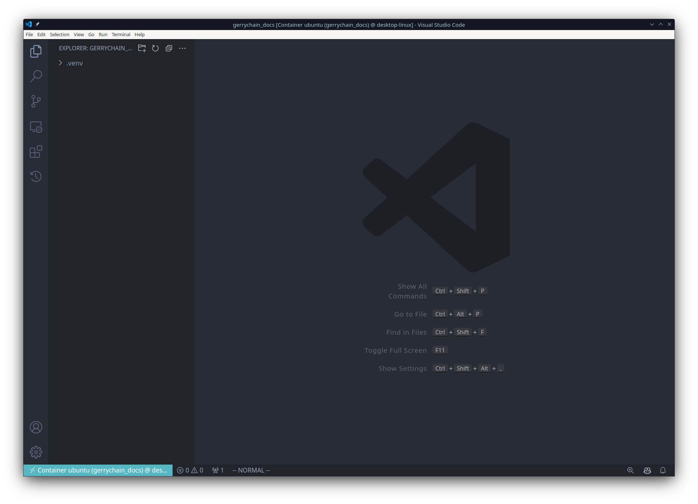

Install Microsoft's Python and Jupyter extensions:

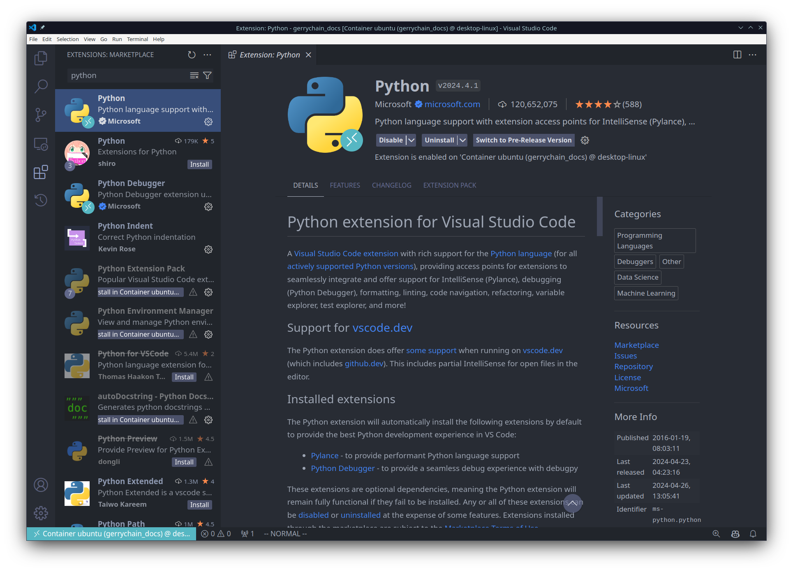

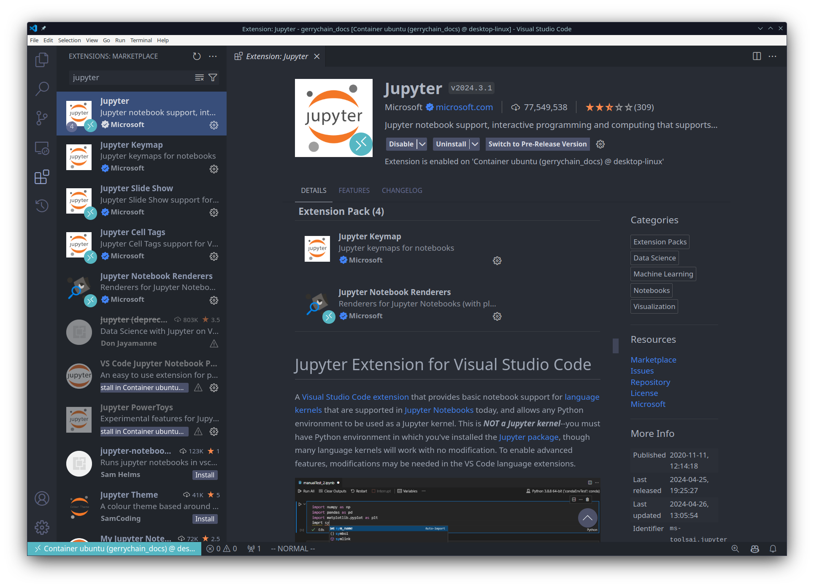

Create and save a file with the ``.ipynb`` extension:

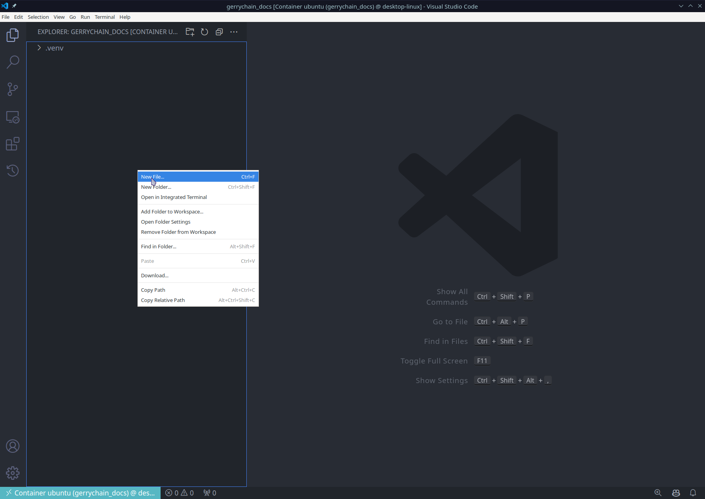

Use the kernel selector in the notebook to choose the interpreter from the project's ``.venv``:

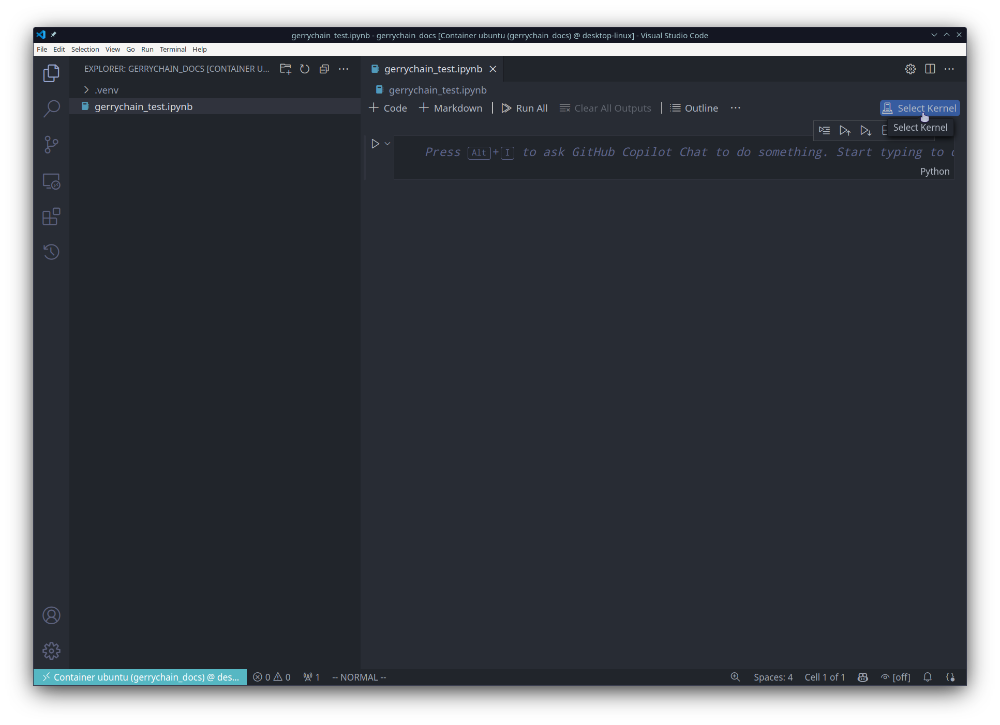

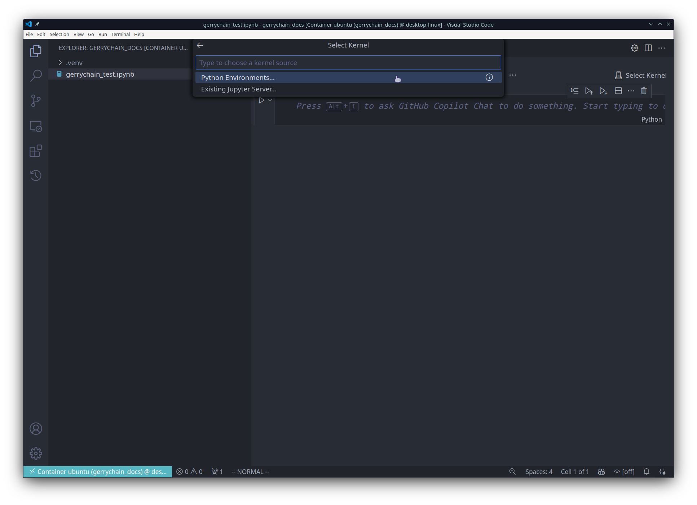

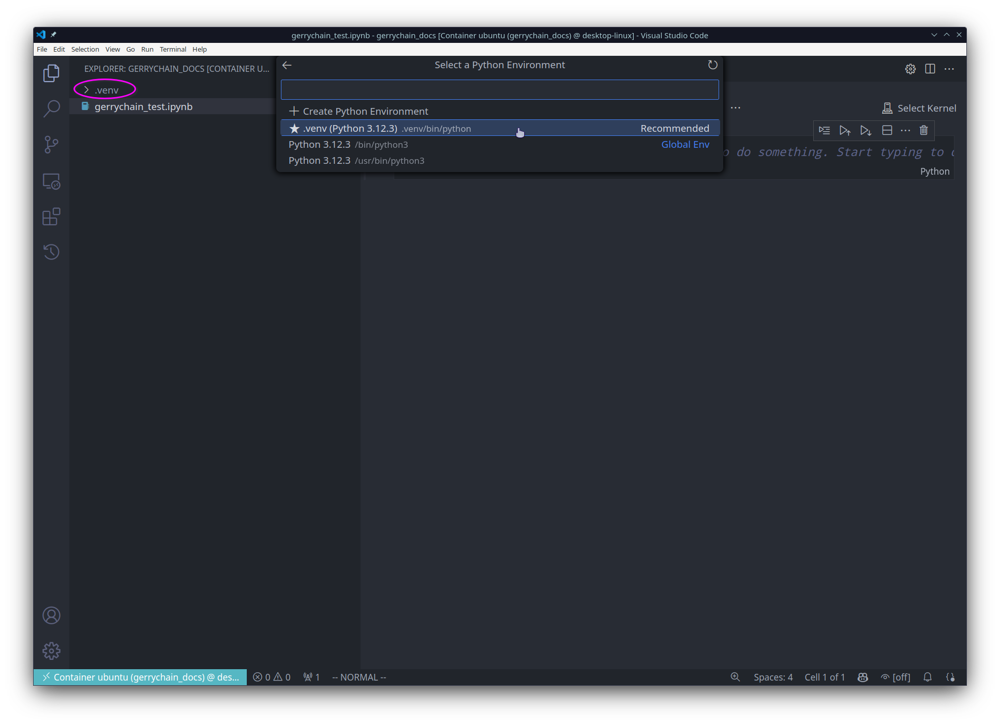

The notebook can now import GerryChain from that environment:

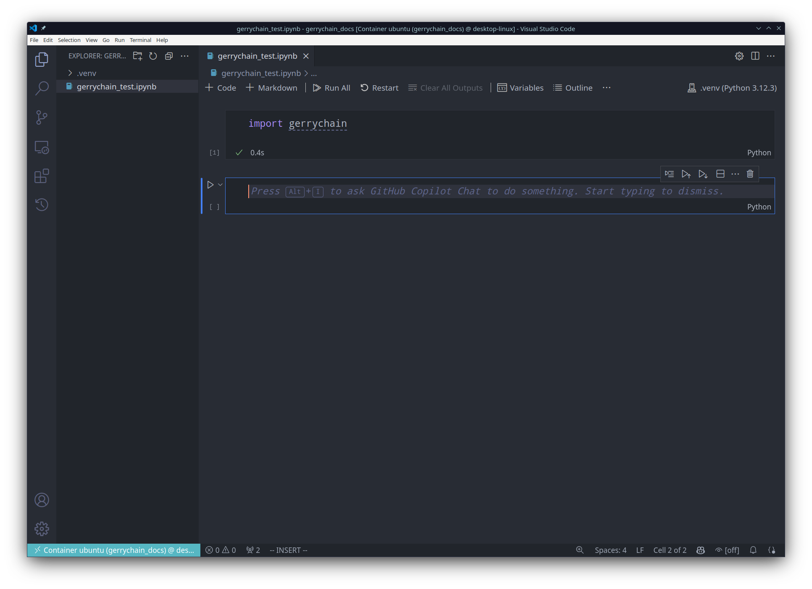

Jupyter Lab or Notebook
^^^^^^^^^^^^^^^^^^^^^^^

Install Jupyter and register the activated virtual environment as a kernel. Give each project's
kernel a distinct name if you use several virtual environments:

.. code-block:: console

  pip install jupyter
  python -m ipykernel install --user --name=venv_my_project
  jupyter lab

The registered environment will appear in the kernel list:

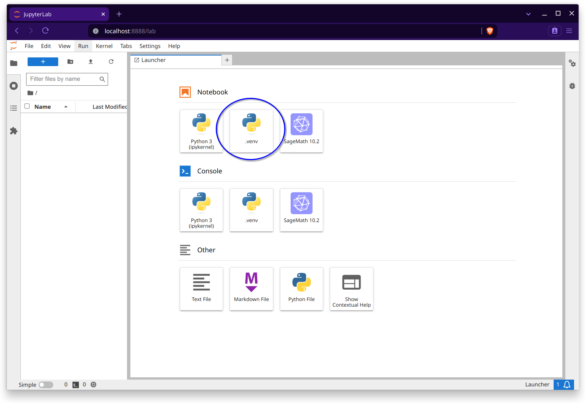

You can inspect registered kernels with ``jupyter kernelspec list``. Create a notebook and select
the project-specific kernel:

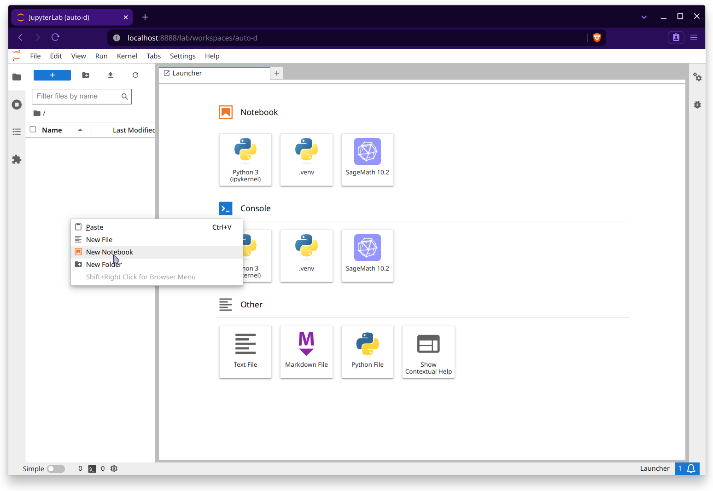

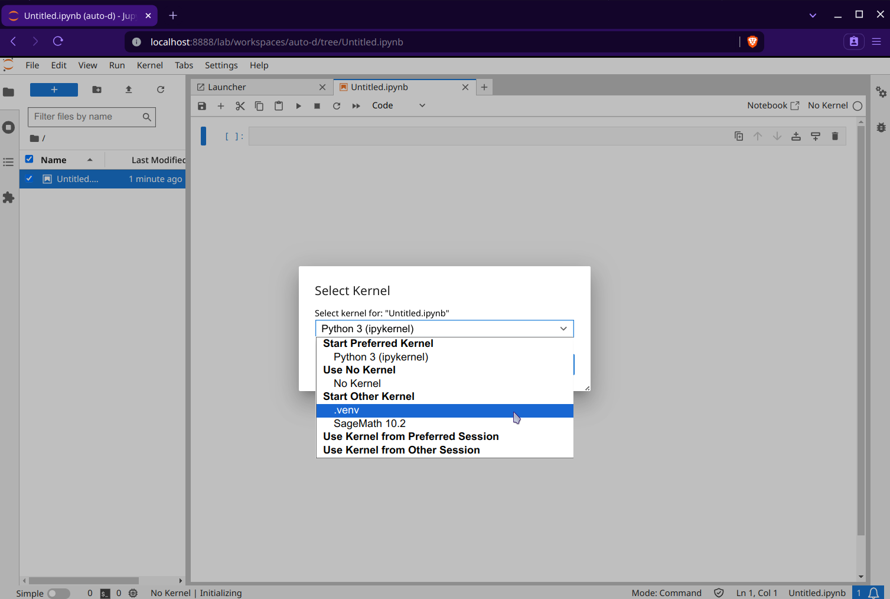

The notebook will then use the GerryChain installation from that virtual environment:

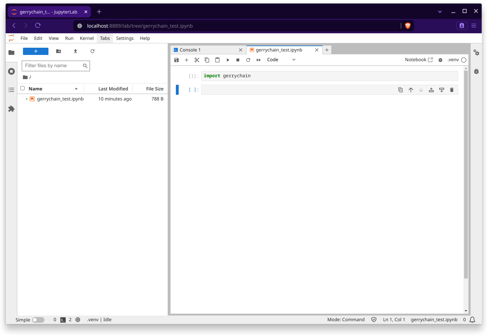
