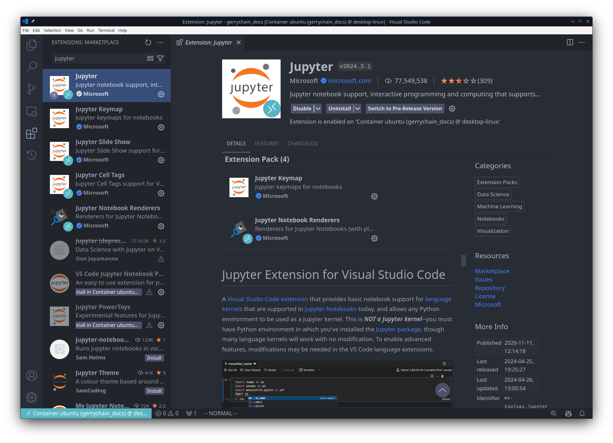
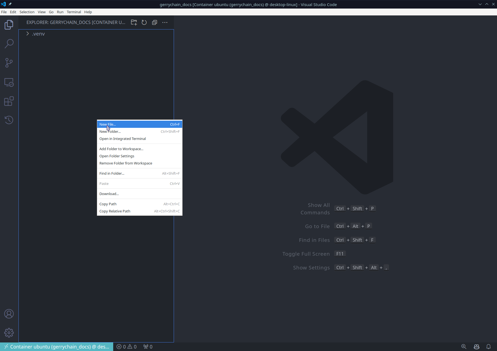
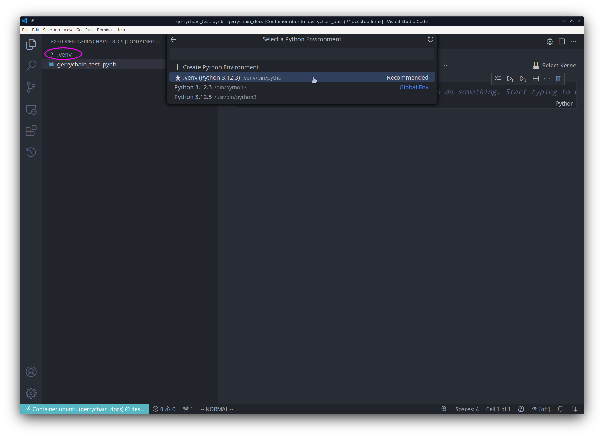
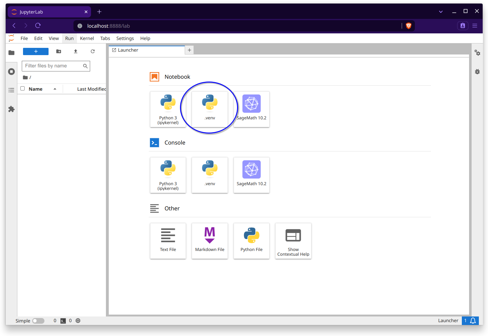
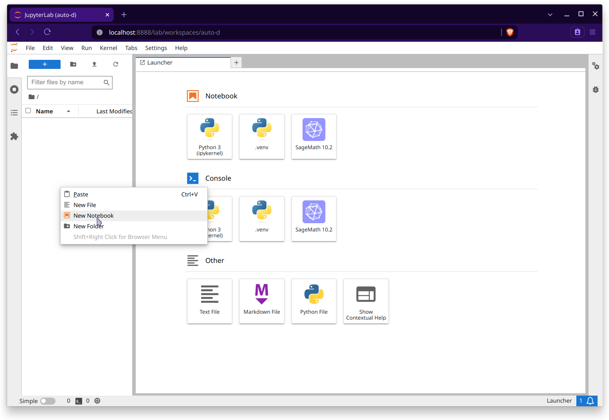
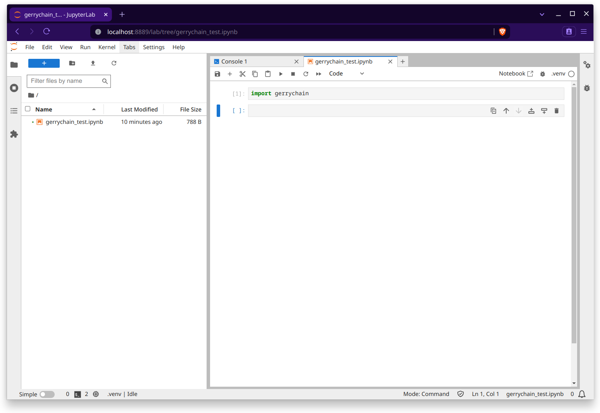

Making an Environment Reproducible
----------------------------------

If you are working on a project wherein you would like to ensure
particular runs are reproducible, it is necessary to invoke

- **MacOS/Linux**: ``export PYTHONHASHSEED=0``
- **Windows**: 

  - PowerShell ``$env:PYTHONHASHSEED=0``
  - Command Prompt ``set PYTHONHASHSEED=0``

before running your code. This will ensure that the hash seed is deterministic
which is important for the replication of spanning trees across your runs. If you
would prefer to not have to do this every time, then you need to modify the
activation script for the virtual environment. Again, this is different depending
on your operating system:

- **MacOS/Linux**: Open the file ``.venv/bin/activate`` located in your working
  directory using your favorite text editor
  and add the line ``export PYTHONHASHSEED=0`` after the ``export PATH`` command. 
  So you should see something like:: 

    _OLD_VIRTUAL_PATH="$PATH"
    PATH="$VIRTUAL_ENV/Scripts:$PATH"
    export PATH

    export PYTHONHASHSEED=0
  
  Then, verify that the hash seed is set to 0 in your Python environment by
  running ``python`` from the command line and typing 
  ``import os; print(os.environ['PYTHONHASHSEED'])``.

- **Windows**: To be safe, you will need to modify 3 files within your virtual
  environment:

  - ``.venv\Scripts\activate``: Add the line ``export PYTHONHASHSEED=0`` after
    the ``export PATH`` command. So you should see something like:: 

      _OLD_VIRTUAL_PATH="$PATH"
      PATH="$VIRTUAL_ENV/Scripts:$PATH"
      export PATH

      export PYTHONHASHSEED=0

  - ``.venv\Scripts\activate.bat``: Add the line ``set PYTHONHASHSEED=0`` to the
    end of the file. So you should see something like::

      if defined _OLD_VIRTUAL_PATH set PATH=%_OLD_VIRTUAL_PATH%
      if not defined _OLD_VIRTUAL_PATH set _OLD_VIRTUAL_PATH=%PATH%

      set PATH=%VIRTUAL_ENV%\Scripts;%PATH%
      rem set VIRTUAL_ENV_PROMPT=(.venv) 
      set PYTHONHASHSEED=0

  - ``.venv\Scripts\Activate.ps1``: Add the line ``$env:PYTHONHASHSEED=0`` to the
    end of the before the signature block. So you should see something like::

      # Add the venv to the PATH
      Copy-Item -Path Env:PATH -Destination Env:_OLD_VIRTUAL_PATH
      $Env:PATH = "$VenvExecDir$([System.IO.Path]::PathSeparator)$Env:PATH"

      $env:PYTHONHASHSEED=0

      # SIG # Begin signature block

After you have made these changes, verify that the hash seed is set to 0 in your
Python environment by running ``python`` from the command line and typing 
``import os; print(os.environ['PYTHONHASHSEED'])`` in the Python prompt.

Reproducible Environments in VSCode and Jupyter Lab 
^^^^^^^^^^^^^^^^^^^^^^^^^^^^^^^^^^^^^^^^^^^^^^^^^^^

In general, it is easier to use jupyter notebooks with bespoke virtual environments
through a text editor like `VSCode <https://code.visualstudio.com/download>`_, but
we will show how to do this using the standard Jupyter Lab interface as well.

Regardless of which method you prefer, you will need to make sure that you have
installed the ``ipykernel`` package into the virtual environment that you will be
working with:

.. code:: console

  pip install ipykernel

VSCode
~~~~~~

First you will want to make sure that you have 
`installed VSCode <https://code.visualstudio.com/download>`_.
Then, you can click on "File" in the upper-left and select "Open Folder" to open the
folder with your project and virtual environment in it. This should look something like
this:

.. image:: ../user/images/vscode_tutorial/open_the_folder.png
  :align: center

Notice that I have the folder ``.venv`` in my file explorer. This is just my virtual
environment that I created for this project.

To install the Python extension, open the extensions view by clicking on the square
icon on the left side of the window. Then, search for "Python" and install the
extension that is published by Microsoft. This will allow you to use the Python
interpreter in your virtual environment and will give you some helpful things like
code completion and debugging in the event that you would like it.

.. image:: ../user/images/vscode_tutorial/python_extension_vscode.png
  :align: center

Likewise, we will want to install the "Jupyter" extension:

Now let's make a new jupyter notebook. You can do this by right-clicking in the file
explorer (or by using the File menu) and selecting "New File".

.. raw:: html

   &nbsp;

Then, you will want to save the file with the extension ``.ipynb`` since we are making
a jupyter notebook. Then we will want to open the file and select the Python interpreter
that we would like to use:

.. image:: ../user/images/vscode_tutorial/select_kernel_vscode.png
  :align: center

.. image:: ../user/images/vscode_tutorial/select_python_env.png
  :align: center

And now we are done! We can now use all of the packages in our ``.venv`` virtual environment.

.. image:: ../user/images/vscode_tutorial/show_gerrychain_import.png
  :align: center

Of course, if you would like to, you may also use a different name for your virtual environment,
or you can even use the same process to allow for multiple virtual environments in the same
project!

Jupyter Lab / Notebook
~~~~~~~~~~~~~~~~~~~~~~

In order to use Jupyter Lab or Jupyter Notebook, we will need to make sure that it is installed
for our virtual environment. This can be done by running the following command:

.. code:: console

  pip install jupyter

Then, we will want to install the kernel for our virtual environment. This can be done by running
the following command:

.. code:: console

  python -m ipykernel install --user --name=.venv

Now, we can open Jupyter Lab by running the following command:

.. code:: console

  jupyter lab

You will now see that the ``.venv`` is available in your list of kernels:

We can now make a new notebook and select the kernel that we would like to use: 

.. image:: ../user/images/jupyter_tutorial/select_kernel.png
  :align: center

.. raw:: html

   &nbsp;

Lastly, we can import GerryChain and use it in our notebook:

