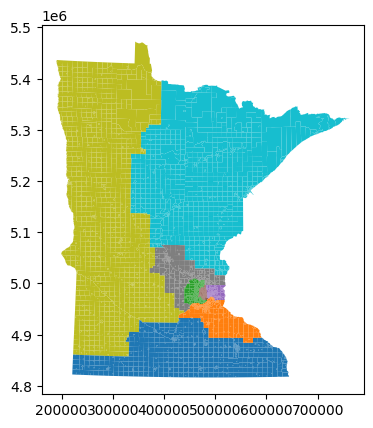
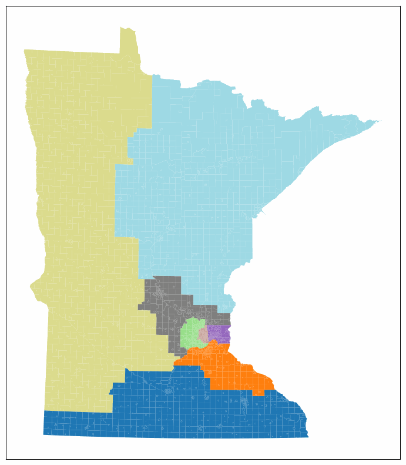

=======================
Working With Geometries
=======================

In the course of working with legislative redistricting data, it is inevitable that
we will have to work with files that contain geometries. Most often, these geometries
come in the form of shapefiles, which, while nice in theory, can be a bit of a pain to
work with in practice. For now, we will focus on the basics of working with geometries,
but the interested reader is encouraged to explore our partnered library, 
`maup <https://github.com/mggg/maup#readme>`_, which is specifically designed to
help fix tricky geometry problems. Specifically, in the event that you are working with
a shapefile and run in to an error of the flavour:

.. code-block:: console

    UserWarning: Found overlaps among the given polygons. 
    Indices of overlaps: {(887, 892), (893, 915), (892, 914), (887, 893)}

or 

.. code-block:: console

    UserWarning: Found islands (degree-0 nodes). Indices of islands: {2552, 3107}
    "Found islands (degree-0 nodes). Indices of islands: {}".format(islands)

then you should consider consulting the 
`maup documentation <https://github.com/mggg/maup/wiki/>`_
to see if it can help you out.

Loading and Running a Plan
--------------------------

.. raw:: html

    

      <a href="https://github.com/mggg/GerryChain/tree/main/docs/_static/MN.zip" class="download-badge" download>Download MN File</a>
    

     

For this example, we will make use of a Minnesota GeoJSON file that contains
the geometries of the state's precincts (you will need to unzip the above
folder to get to the file -- it's a bit large). We will follow a similar workflow to
what we already covered in the `ReCom Section <./recom.html>`_, but with an eye
towards some of the conveniences afforded by ``GeographicPartition`` objects. As always,
we'll start with the imports:

.. code-block:: python

    import matplotlib.pyplot as plt
    from gerrychain import (Partition, Graph, MarkovChain,
                            updaters, constraints, accept,
                            GeographicPartition)
    from gerrychain.proposals import recom
    from gerrychain.tree import bipartition_tree
    from gerrychain.constraints import contiguous
    from functools import partial
    import pandas

    # Set the random seed so that the results are reproducible!
    import random
    random.seed(42)

And now we load the graph from the GeoJSON file

.. code-block:: python

    graph = Graph.from_file("MN_precincts.geojson")

as well as define our updaters and initial partition

.. code-block:: python

    my_updaters = {
        "population": updaters.Tally("TOTPOP", alias="population"),
        "cut_edges": updaters.cut_edges,
        "perimeter": updaters.perimeter,
        "area": updaters.Tally("area", alias="area"),
    }

    initial_partition = GeographicPartition(
        graph,
        assignment="CONGDIST",
        updaters=my_updaters
    )

The observant reader will notice that we have added two new updaters, ``perimeter``,
and ``area``, [1]_ and we are now using the ``GeographicPartition`` class instead of the
``Partition`` class. The ``GeographicPartition`` class is a subclass of the
``Partition`` class that allows us the capability of working with geometries throughout
our Markov chain, and the ``perimeter`` and ``area`` updaters are examples of such a 
geometric updater that was previously unavailable to us. These updaters are necessary for
monitoring things like geometric compactness and area via metrics such as the Polsby-Popper
test. [2]_ 

And now it is time for one of the first conveniences of the ``GeographicPartition`` class:
we can plot our map and see the initial partition!

.. code-block:: python

    initial_partition.plot()

Of course, this isn't very pretty, so let's pass it some additional arguments to 
things a bit nicer:

.. code-block:: python
  
    fig, ax = plt.subplots(figsize=(8,8))
    ax.set_yticks([])
    ax.set_xticks([])
    ax.set_title("Initial Partition in MN")
    initial_partition.plot(ax=ax, cmap='tab20c')

.. image:: ./images/MN_initial_partition_pretty.png
    :align: center
    :height: 400px

Under the hood, the ``plot`` method is using the ``geodataframe.plot`` method from
`geopandas <https://geopandas.org/>`_ to plot the geometries, and all of this is 
built on top of ``matplotlib``, so most of the standard methods for modifying a
``matplotlib`` plot will work here as well.

Now that we have our initial partition, we can run a Markov chain on it just as we
have previously:

.. code-block:: python

    ideal_population = sum(initial_partition["population"].values()) / len(initial_partition)

    proposal = partial(
        recom,
        pop_col="TOTPOP",
        pop_target=ideal_population,
        epsilon=0.01,
        node_repeats=2,
    )

    recom_chain = MarkovChain(
        proposal=proposal,
        constraints=[contiguous],
        accept=accept.always_accept,
        initial_state=initial_partition,
        total_steps=20,
    )

And the next bit of code will make a fun little widget that will allow us to 
watch the chain work!

.. code-block:: python

    %matplotlib inline
    import matplotlib_inline.backend_inline
    matplotlib_inline.backend_inline.set_matplotlib_formats('png')

    import pandas as pd

    import matplotlib.cm as mcm
    import matplotlib.pyplot as plt
    import networkx as nx
    from PIL import Image
    import io
    import ipywidgets as widgets
    from IPython.display import display, clear_output

    frames = []
    district_data = []

    for i, partition in enumerate(recom_chain):
        for district_name in partition.perimeter.keys():
            population = partition.population[district_name]
            perimeter = partition.perimeter[district_name]
            area = partition.area[district_name]
            district_data.append((i, district_name, population, perimeter, area))

        buffer = io.BytesIO()
        fig, ax = plt.subplots(figsize=(10,10))
        partition.plot(ax=ax, cmap='tab20')
        ax.set_xticks([])
        ax.set_yticks([])
        plt.savefig(buffer, format='png', bbox_inches='tight')
        buffer.seek(0)
        image = Image.open(buffer)
        frames.append(image)
        plt.close(fig)

    df = pd.DataFrame(
        district_data,
        columns=[
            'step',
            'district_name',
            'population',
            'perimeter',
            'area'
        ]
    )

    def show_frame(idx):
        clear_output(wait=True)
        display(frames[idx])

    slider = widgets.IntSlider(value=0, min=0, max=len(frames)-1, step=1, description='Frame:')
    slider.layout.width = '500px'
    widgets.interactive(show_frame, idx=slider)

which should look something like this:

and our dataframe has collected all of the data we were interested in:

.. code-block:: python

    df.head(5)
  

+---+------+---------------+------------+---------------+--------------+
|   | step | district_name | population |   perimeter   |     area     |
+===+======+===============+============+===============+==============+
| 0 |  0   |       8       |  662998.0  | 1.804646e+06  | 7.807545e+10 |
+---+------+---------------+------------+---------------+--------------+
| 1 |  0   |       6       |  662979.0  | 6.616450e+05  | 7.864760e+09 |
+---+------+---------------+------------+---------------+--------------+
| 2 |  0   |       5       |  662985.0  | 1.133867e+05  | 3.678103e+08 |
+---+------+---------------+------------+---------------+--------------+
| 3 |  0   |       3       |  662994.0  | 2.625007e+05  | 1.509425e+09 |
+---+------+---------------+------------+---------------+--------------+
| 4 |  0   |       7       |  662997.0  | 2.288428e+06  | 9.165192e+10 |
+---+------+---------------+------------+---------------+--------------+

.. [1] The ``perimeter`` and ``area`` attributes are actually not present in the 
  MN_precincts.geojson file, but the ``GeographicPartition`` class will calculate
  them at instantiation time using the geometries provided in the file.
.. [2] The Poslby-Popper test is a part of ``gerrychain``'s ``metrics`` submodule
  as well.

