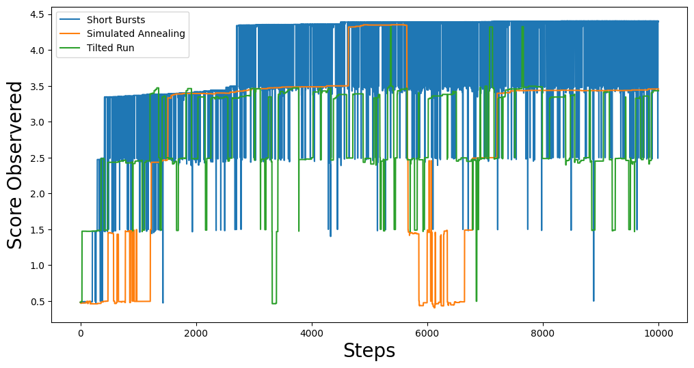

==================================
Optimization Methods of GerryChain
==================================

In GerryChain, we provide a class known as the ``SingleMetricOptimizer`` as well as a
``Gingelator``` subclass that allow us to perform optimization runs.


Currently, there are 3 different optimization methods available in GerryChain:

- **Short Bursts**: This method chains together a series of neutral explorers. The main
    idea is to run the chain for a short period of time (short burst) and then continue
    the chain from the partition that maximizes the objective function within the most
    recent short burst. For more information, please refer to 
    `this paper <https://arxiv.org/abs/2011.02288>`_.
- **Simulated Annealing**: This method varies the probablity of accepting a worse plan
   according to a temperature schedule which ranges from 0 to 1.
- **Tilted Runs**: This method accepts a worse plan with a fixed probability :math:`p`. 


While sampling naively with GerryChain can give us an understanding of the neutral
baseline for a state, there are often cases where we want to find plans with
properties that are rare to encounter in a neutral run. Many states have
laws/guidelines that state that plans should be as compact as feasibly possible, maximize
preservation of political boundaries and/or communities of interest, some even look to
minimize double bunking of incumbents or seek proportionality/competitiveness in
contests. Heuristic optimization methods can be used to find example plans with these
properties and to explore the trade-offs between them.


.. raw:: html

    <div class="center-container">
      <a href="https://github.com/mggg/GerryChain/tree/main/docs/_static/BG_05.json" class="download-badge" download>
        Download Example File
      </a>
    </div>
    <br style="line-height: 5px;">

The first thing we should do is set up our import statements

.. code:: python

    from gerrychain import (GeographicPartition, Partition, Graph, MarkovChain,
                            proposals, updaters, constraints, accept, Election)
    from gerrychain.optimization import SingleMetricOptimizer, Gingleator
    from gerrychain.tree import recursive_seed_part
    from functools import partial
    import pandas as pd
    import json
    from networkx.readwrite import json_graph
    import matplotlib.pyplot as plt
    from tqdm import tqdm
    import numpy as np
    import random

    random.seed(2024)


And now we load in our file and set up our initial chain.

.. code:: python

    graph = Graph.from_json("BG_05.json")

    POPCOL = "TOTPOP"
    SEN_DISTS = 35
    EPS = 0.02
    TOTPOP = sum(graph.nodes()[n][POPCOL] for n in graph.nodes())

    chain_updaters = {
    "population": updaters.Tally(POPCOL, alias="population"),
    "VAP": updaters.Tally("VAP"),
    "BVAP": updaters.Tally("BVAP")
    }

    initial_partition = Partition.from_random_assignment(
        graph=graph,
        n_parts=SEN_DISTS,
        epsilon=EPS,
        pop_col=POPCOL,
        updaters=chain_updaters
    )

    proposal = partial(
        proposals.recom,
        pop_col=POPCOL,
        pop_target=TOTPOP/SEN_DISTS,
        epsilon=EPS,
        node_repeats=1
    )

    constraints = constraints.within_percent_of_ideal_population(initial_partition, EPS)


Using ``SingleMetricOptimizer``
-------------------------------

Now the `SingleMetricOptimizer` is set up as a wrapper around our basic `MarkovChain`
class, so interacting with it should be familiar. To set up our optimizer, we, we simply
pass it a proposal function, some constraints, an initial state, and the objective function:

.. code:: python

    num_cut_edges = lambda p: len(p["cut_edges"])

    optimizer = SingleMetricOptimizer(
        proposal=proposal,
        constraints=constraints,
        initial_state=initial_partition,
        optimization_metric=num_cut_edges,
        maximize=False
    )

And now we can run each of the optimization methods and collect some data!

.. code:: python

    total_steps = 10000
    
    # Short Bursts
    min_scores_sb = np.zeros(total_steps)
    for i, part in enumerate(optimizer.short_bursts(5, 2000, with_progress_bar=True)):
        min_scores_sb[i] = optimizer.best_score
    
    # Simulated Annealing
    min_scores_anneal = np.zeros(total_steps)
    for i, part in enumerate(
        optimizer.simulated_annealing(
            total_steps,
            optimizer.jumpcycle_beta_function(200, 800),
            beta_magnitude=1,
            with_progress_bar=True
        )
    ):
        min_scores_anneal[i] = optimizer.best_score

    # Tilted Runs
    min_scores_tilt = np.zeros(total_steps)
    for i, part in enumerate(optimizer.tilted_run(total_steps, p=0.125, with_progress_bar=true)):
        min_scores_tilt[i] = optimizer.best_score

We can then plot the results to see how each method performed:

.. code:: python

    fig, ax = plt.subplots(figsize=(12,6))
    plt.plot(min_scores_sb, label="Short Bursts")
    plt.plot(min_scores_anneal, label="Simulated Annealing")
    plt.plot(min_scores_tilt, label="Tilted Run")
    plt.xlabel("Steps", fontsize=20)
    plt.ylabel("Min #CutEdges Observered", fontsize=20)
    plt.legend()
    plt.show()


This should give you something like:

.. image:: ./images/single_metric_opt_comparison.png
    :align: center
    :alt: Single Metric Optimization Method Comparison Image


Using ``Gingleator``
--------------------

Named for the Supreme Court case *Thornburg v. Gingles*, which created their precedent
as one of the litmus tests in bringing forth a VRA court case, **Gingles' Districts** are
districts that are 50% + 1 of a minority population subgroup (more colloquially called
majority-minority districts).  It is common to seek plans with greater/maximal numbers
of gingles districts to understand the landscape of the state space.

The `Gingleator` class is a subclass of the `SingleMetricOptimizer` class, so much of
the setup is the same:

.. code:: python

    gingles = Gingleator(
        proposal, 
        constraints, 
        initial_partition,
        minority_pop_col="BVAP",
        total_pop_col="VAP",
        score_function=Gingleator.reward_partial_dist
    )

Likewise, the methods are similar as well:

.. code:: python

    total_steps = 10000

    # Short Bursts
    max_scores_sb = np.zeros(total_steps)
    scores_sb = np.zeros(total_steps)
    for i, part in enumerate(gingles.short_bursts(10, 1000, with_progress_bar=True)):
        max_scores_sb[i] = gingles.best_score
        scores_sb[i] = gingles.score(part)    min_scores_sb = np.zeros(total_steps)
        for i, part in enumerate(gingles.short_bursts(5, 2000, with_progress_bar=True)):
            min_scores_sb[i] = gingles.best_score

    # Simulated Annealing
    max_scores_anneal = np.zeros(total_steps)
    scores_anneal = np.zeros(total_steps)
    for i, part in enumerate(
        gingles.simulated_annealing(
            total_steps,
            gingles.jumpcycle_beta_function(1000, 4000),
            beta_magnitude=500, 
            with_progress_bar=True
        )
    ):
        max_scores_anneal[i] = gingles.best_score
        scores_anneal[i] = gingles.score(part)

    # Tilted Runs
    max_scores_tilt = np.zeros(total_steps)
    scores_tilt = np.zeros(total_steps)
    for i, part in enumerate(gingles.tilted_run(total_steps, 0.125, with_progress_bar=True)):
        max_scores_tilt[i] = gingles.best_score
        scores_tilt[i] = gingles.score(part)

And we can plot the results again:

.. code:: python

    fig, ax = plt.subplots(figsize=(12,6))
    plt.plot(max_scores_sb, label="Short Bursts")
    plt.plot(max_scores_anneal, label="Simulated Annealing")
    plt.plot(max_scores_tilt, label="Tilted Run")
    plt.xlabel("Steps", fontsize=20)
    plt.ylabel("Max Score Observered", fontsize=20)
    plt.legend()
    plt.show()

This should give you something like:

.. image:: ./images/gingleator_maxes.png
    :align: center
    :alt: Gingleator Optimization Method Comparison Image

And we can see a little better how each method performs over the course of the run
by looking at all of the scores relative to the previous graph:



From this we can observe that, throughout the entire run, the score function can dip all
the way back down to 0 even relatively shortly after being at the maximum of 4.5.