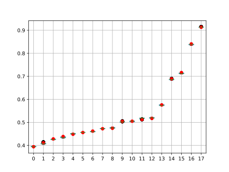

.. _quickstart:

===============================
Getting started with GerryChain
===============================

This guide will show you how to start generating ensembles with GerryChain.

What you'll need
================

Before we can start running Markov chains, you'll need to:

* Install ``gerrychain`` from PyPI. See the :doc:`installation guide <./install>` for instructions.
* Download `this example json of Pennsylvania's VTDs <https://github.com/mggg/GerryChain/tree/main/docs/_static/PA_VTDs.json>`_.
* Open your preferred Python environment (e.g. JupyterLab, IPython, or a ``.py`` file
  in your favorite editor) in the directory containing the ``PA_VTDs.json`` file
  that you downloaded.

Throughout this guide, we will assume that the user is working with a jupyter notebook
or a python script file (a \*.py file). We will also assume that the end user is working
through this guide is familiar with, but still relatively new to Python.

Also please note that, while this guide makes use of the "propose_random_flip" proposal
function, this is not the only proposal function available in GerryChain (in fact, it is
the one that we use the least). We are only using it here because it provides for
a simple example of how to run a Markov chain.

.. Note::
  
  If you are having any trouble getting the materials on this tutorial to work, please
  consult the :doc:`installation guide <./install>` first, and then, if you're still having
  issues, feel free to send us a message at code[at]mggg[dot]org.

Creating the initial partition
==============================

.. raw:: html

    

      <a href="https://github.com/mggg/GerryChain/tree/main/docs/_static/PA_VTDs.json" class="download-badge" download>Download PA File</a>
    

     

In order to run a Markov chain, we need an
adjacency :class:`~gerrychain.Graph` of our VTD geometries and
:class:`~gerrychain.Partition` of our adjacency graph into districts. This Partition
will be the initial state of our Markov chain.

.. code-block:: python

    from gerrychain import Graph, Partition
    from gerrychain.updaters import Tally, cut_edges

    # Load the graph in from the provided json file
    graph = Graph.from_json("./PA_VTDs.json")

    # Set up the initial partition object
    initial_partition = Partition(
        graph,
        assignment="2011_PLA_1",
        updaters={
            "population": Tally("TOT_POP", alias="population"),
            "cut_edges": cut_edges,
        }
    )

Here's what's happening in this code block.

The :meth:`Graph.from_json() <gerrychain.Graph.from_json>` classmethod creates a
:class:`~gerrychain.Graph` of the precincts. By default, this method
copies all of the data columns from the shapefile's attribute table to the ``graph`` object
as node attributes. The contents of this particular shapefile's attribute table are
summarized in the `mggg-states/PA-shapefiles <https://github.com/mggg-states/PA-shapefiles#metadata>`_
GitHub repo.
    
Then, we create a :class:`~gerrychain.Partition` of the graph.
This will be the starting point for our Markov chain. The :class:`~gerrychain.Partition` class
takes three arguments:

:graph: A graph.
:assignment: An assignment of the nodes of the graph into parts of the partition. This can be either
    a dictionary mapping node IDs to part IDs, or the string key of a node attribute that holds
    each node's assignment. In this example we've written ``assignment="2011_PLA_1"`` to tell the :class:`~gerrychain.Partition`
    to assign nodes by their ``"2011_PLA_1"`` attribute that we copied from the shapefile. This attributes holds the
    assignments of precincts to congressional districts from the 2010 redistricting cycle.
:updaters: An optional dictionary of "updater" functions. Here we've provided an updater named ``"population"`` that
    computes the total population of each district in the partition, based on the ``"TOT_POP"`` node attribute
    from our shapefile, and a ``cut_edges`` updater. This returns all of the edges in the graph
    that cross from one part to another, and is used by ``propose_random_flip`` to find a random boundary node to
    flip.

With the ``"population"`` updater configured, we can see the total population in each of our congressional districts.

.. code-block:: python

    for district, pop in initial_partition["population"].items():
        print(f"District {district}: {pop}")

(the "f" before the string here marks this as a formatted string, and we use this
to make printing combinations of strings and variable values a bit easier)
This code will print out something like the following::

    District 3: 706653
    District 10: 706992
    District 9: 702500
    District 5: 695917
    District 15: 705549
    District 6: 705782
    District 11: 705115
    District 8: 705689
    District 4: 705669
    District 18: 705847
    District 12: 706232
    District 17: 699133
    District 7: 712463
    District 16: 699557
    District 14: 705526
    District 13: 705028
    District 2: 705689
    District 1: 705588

Notice that ``partition["population"]`` is a dictionary mapping the ID of each district to its total
population (that's why we can call the ``.items()`` method on it). Most updaters output values in this dictionary format.

And that is it! From here, you can move on to configuring and 

Running a chain
===============

Now that we have our initial partition, we can configure and run a :class:`Markov chain <gerrychain.MarkovChain>`.
Let's configure a short Markov chain to make sure everything works properly. ::

    from gerrychain import MarkovChain
    from gerrychain.constraints import single_flip_contiguous
    from gerrychain.proposals import propose_random_flip
    from gerrychain.accept import always_accept

    chain = MarkovChain(
        proposal=propose_random_flip,
        constraints=[single_flip_contiguous],
        accept=always_accept,
        initial_state=initial_partition,
        total_steps=1000
    )

To configure a chain, we need to specify five objects.

:proposal: A function that takes the current state and returns new district assignments ("flips") for one
    or more nodes. This comes in the form of a dictionary mapping one or more node IDs to their new district IDs.
    Here we've used the ``propose_random_flip`` proposal, which proposes that a random node on the boundary of one
    district be flipped into the neighboring district.
:constraints: A list of binary constraints (functions that take a partition and return ``True`` or ``False``) that
    together define which districting plans. are valid. Here we've used just a single constraint, ``single_flip_contiguous``,
    which checks that each district in  the plan is contiguous. This particular constraint is
    optimized for the single-flip proposal function we are using (hence the name). We could add more
    constraints to require that districts have nearly-equal population, to impose a bound on the compactness of
    the districts according to some score, or to prevent districts from splitting more counties than the original plan.
:accept: A function that takes a valid proposed state and returns ``True`` or ``False`` to signal whether
    the random walk should indeed move to the proposed state. ``always_accept`` always accepts valid proposed states.
    If you want to implement Metropolis-Hastings or any other more sophisticated acceptance criterion, you can
    specify your own custom acceptance function here.
:initial_state: The starting partition from which we would like to initiate our random walk.
:total_steps: The total number of steps to take. Invalid proposals are not counted toward this total, but
    rejected (by ``accept``) valid states are.

For more information on the details of our Markov chain implementation, consult
the :class:`gerrychain.MarkovChain` documentation and source code.

The above code configures a Markov chain called ``chain``, but does *NOT* run it yet. We run the chain
by iterating through all of the states using a ``for`` loop. As an example, let's iterate through
this chain and print out the population of district 1.

.. code-block:: python

    i = 1
    for partition in chain:
        print(f"Step {i} population for district 1: {partition['population'][1]}")
        i += 1

That's all: you've run a Markov chain!

.. admonition:: Coding Note
  :class: note
    
    If the step information is important to the analysis that you're doing, you can
    also iterate through the chain slightly more elegantly using the :func:`enumerate` 
    function.

    .. code-block:: python

        for i, partition in enumerate(chain):
            print(f"Step {i} population for district 1: {partition['population'][1]}")

Working With Elections
----------------------

Of course, ``gerrychain`` was build for analyzing districting plans, so it seems
like it would be important to be able to analyze election results. We can do this
by adding an :class:`~gerrychain.Election` object to our :class:`~gerrychain.Partition`
as an updater. To do this, we'll need to import the :class:`~gerrychain.Election` class
and change around our initial partition a bit.

.. code-block:: python

    from gerrychain import Election

    # Set up the election updater. We give the election a name ("SEN12") and tell it
    # which column in our shapefile holds the Democratic vote totals ("USS12D")
    # and which column holds the Republican vote totals ("USS12R").
    election = Election("SEN12", {"Dem": "USS12D", "Rep": "USS12R"})

    initial_partition_2 = Partition(
        graph,
        assignment="2011_PLA_1",
        updaters={
            "population": Tally("TOT_POP", alias="population"),
            "cut_edges": cut_edges,
            "SEN12": election
        }
    )

You can see that the new election that we have added here is called ``"SEN12"`` and
we placed in the ``updaters`` dictionary so that we can track it for every partition
across the Markov chain. Here we have also given the election the name ``"SEN12"``
and we told ``gerrychain`` that the Democratic vote share, which we call ``"Dem"``
is stored in the ``"USS12D"`` attribute of our file. Likewise, we told `gerrychain`
that the Republican vote share, which we call ``"Rep"`` is stored in the ``"USS12R"``
attribute.

Now, we just need to make a new chain, and we can print off some election data!

.. code-block:: python

    from gerrychain.constraints import contiguous

    chain_2 = MarkovChain(
        proposal=propose_random_flip,
        constraints=[contiguous],
        accept=always_accept,
        initial_state=initial_partition_2,
        total_steps=1000
    )

    for (i, partition) in enumerate(chain_2):
        print(f"Step {i} Democratic vote share for district 1: "
              f"{partition['SEN12'].percents('Dem')[1]:0.4f}")

.. admonition:: Coding Note
    :class: note

    The ``:0.4f`` in the above code is a formatting string that tells Python to print
    the preceding number with four decimal places. This is just a formatting string, and is not
    specific to `gerrychain`. Also, we have split the string onto different lines
    for the sake of readability since python automatically concatenates adjacent strings.

Using DataFrames to Collect Information
---------------------------------------

Printing out data is nice, but it's not very useful for analysis. Instead, it would
be good if we could collect all of the data from our Markov chain in a list
and then convert it into a :mod:`pandas` :class:`~pandas.DataFrame` for analysis.

.. _list-comprehension:

.. code-block:: python

    import pandas

    d_percents = []
    for partition in chain_2:
        # We use the sorted function here to ensure that the data is in the same order
        # as the districts assignments
        d_percents.append(sorted(partition["SEN12"].percents("Dem")))

    data = pandas.DataFrame(d_percents)

.. admonition:: Coding Note
    :class: note

    A more elegant way of achieving the same result is to use a list comprehension 
    instead of a ``for`` loop.

    .. code-block:: python

        data = pandas.DataFrame(
            [sorted(partition["SEN12"].percents("Dem")) 
            for partition in chain_2]
        )

.. attention::
    
    The above code will collect data from a different ensemble than the previous ``for`` loop.
    Each time we iterate through the ``chain`` object, we run a brand new Markov chain
    (using the same configuration that we defined when instantiating ``chain``).

The `pandas`_ :class:`DataFrame` object also has many helpful methods for analyzing and plotting
data. For example, we can produce a boxplot of our ensemble's Democratic vote percentage
vectors, with the initial 2011 districting plan plotted in red, in just a few lines of code:

.. code-block:: python

    import matplotlib.pyplot as plt
    
    ax = data.boxplot(positions=range(len(data.columns)))
    plt.plot(data.iloc[0], "ro")

    plt.show()

.. _`pandas`: https://pandas.pydata.org/

From this, you should get something like the following:

(Before you over-analyze this data, keep in mind that this is a toy ensemble of just
1000 plans created by single flips.)

Next steps
==========

To see a more elaborate example that uses the ReCom proposal, see :doc:`./recom`.

To learn more about the specific components of GerryChain, see the :doc:`/api`.

