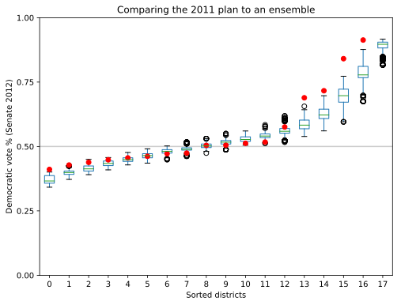

==========================
Running a chain with ReCom
==========================

This document shows how to run a chain using the ReCom proposal used in MGGG's
`2018 Virginia House of Delegates`_ report.

Our goal is to use ReCom to generate an ensemble of districting plans for Pennsylvania,
and then make a box plot comparing the Democratic vote shares for plans in our ensemble
to the 2011 districting plan that the Pennsylvania Supreme Court found to be a
Republican-favoring partisan gerrymander.

This code is also available `as a Jupyter notebook`_.

You can run this example in an interactive Jupyter Notebook session in your
browser, without installing anything, using Binder:

.. image:: https://img.shields.io/badge/launch-binder-579ACA.svg?logo=data:image/png;base64,iVBORw0KGgoAAAANSUhEUgAAAFkAAABZCAMAAABi1XidAAAB8lBMVEX///9XmsrmZYH1olJXmsr1olJXmsrmZYH1olJXmsr1olJXmsrmZYH1olL1olJXmsr1olJXmsrmZYH1olL1olJXmsrmZYH1olJXmsr1olL1olJXmsrmZYH1olL1olJXmsrmZYH1olL1olL0nFf1olJXmsrmZYH1olJXmsq8dZb1olJXmsrmZYH1olJXmspXmspXmsr1olL1olJXmsrmZYH1olJXmsr1olL1olJXmsrmZYH1olL1olLeaIVXmsrmZYH1olL1olL1olJXmsrmZYH1olLna31Xmsr1olJXmsr1olJXmsrmZYH1olLqoVr1olJXmsr1olJXmsrmZYH1olL1olKkfaPobXvviGabgadXmsqThKuofKHmZ4Dobnr1olJXmsr1olJXmspXmsr1olJXmsrfZ4TuhWn1olL1olJXmsqBi7X1olJXmspZmslbmMhbmsdemsVfl8ZgmsNim8Jpk8F0m7R4m7F5nLB6jbh7jbiDirOEibOGnKaMhq+PnaCVg6qWg6qegKaff6WhnpKofKGtnomxeZy3noG6dZi+n3vCcpPDcpPGn3bLb4/Mb47UbIrVa4rYoGjdaIbeaIXhoWHmZYHobXvpcHjqdHXreHLroVrsfG/uhGnuh2bwj2Hxk17yl1vzmljzm1j0nlX1olL3AJXWAAAAbXRSTlMAEBAQHx8gICAuLjAwMDw9PUBAQEpQUFBXV1hgYGBkcHBwcXl8gICAgoiIkJCQlJicnJ2goKCmqK+wsLC4usDAwMjP0NDQ1NbW3Nzg4ODi5+3v8PDw8/T09PX29vb39/f5+fr7+/z8/Pz9/v7+zczCxgAABC5JREFUeAHN1ul3k0UUBvCb1CTVpmpaitAGSLSpSuKCLWpbTKNJFGlcSMAFF63iUmRccNG6gLbuxkXU66JAUef/9LSpmXnyLr3T5AO/rzl5zj137p136BISy44fKJXuGN/d19PUfYeO67Znqtf2KH33Id1psXoFdW30sPZ1sMvs2D060AHqws4FHeJojLZqnw53cmfvg+XR8mC0OEjuxrXEkX5ydeVJLVIlV0e10PXk5k7dYeHu7Cj1j+49uKg7uLU61tGLw1lq27ugQYlclHC4bgv7VQ+TAyj5Zc/UjsPvs1sd5cWryWObtvWT2EPa4rtnWW3JkpjggEpbOsPr7F7EyNewtpBIslA7p43HCsnwooXTEc3UmPmCNn5lrqTJxy6nRmcavGZVt/3Da2pD5NHvsOHJCrdc1G2r3DITpU7yic7w/7Rxnjc0kt5GC4djiv2Sz3Fb2iEZg41/ddsFDoyuYrIkmFehz0HR2thPgQqMyQYb2OtB0WxsZ3BeG3+wpRb1vzl2UYBog8FfGhttFKjtAclnZYrRo9ryG9uG/FZQU4AEg8ZE9LjGMzTmqKXPLnlWVnIlQQTvxJf8ip7VgjZjyVPrjw1te5otM7RmP7xm+sK2Gv9I8Gi++BRbEkR9EBw8zRUcKxwp73xkaLiqQb+kGduJTNHG72zcW9LoJgqQxpP3/Tj//c3yB0tqzaml05/+orHLksVO+95kX7/7qgJvnjlrfr2Ggsyx0eoy9uPzN5SPd86aXggOsEKW2Prz7du3VID3/tzs/sSRs2w7ovVHKtjrX2pd7ZMlTxAYfBAL9jiDwfLkq55Tm7ifhMlTGPyCAs7RFRhn47JnlcB9RM5T97ASuZXIcVNuUDIndpDbdsfrqsOppeXl5Y+XVKdjFCTh+zGaVuj0d9zy05PPK3QzBamxdwtTCrzyg/2Rvf2EstUjordGwa/kx9mSJLr8mLLtCW8HHGJc2R5hS219IiF6PnTusOqcMl57gm0Z8kanKMAQg0qSyuZfn7zItsbGyO9QlnxY0eCuD1XL2ys/MsrQhltE7Ug0uFOzufJFE2PxBo/YAx8XPPdDwWN0MrDRYIZF0mSMKCNHgaIVFoBbNoLJ7tEQDKxGF0kcLQimojCZopv0OkNOyWCCg9XMVAi7ARJzQdM2QUh0gmBozjc3Skg6dSBRqDGYSUOu66Zg+I2fNZs/M3/f/Grl/XnyF1Gw3VKCez0PN5IUfFLqvgUN4C0qNqYs5YhPL+aVZYDE4IpUk57oSFnJm4FyCqqOE0jhY2SMyLFoo56zyo6becOS5UVDdj7Vih0zp+tcMhwRpBeLyqtIjlJKAIZSbI8SGSF3k0pA3mR5tHuwPFoa7N7reoq2bqCsAk1HqCu5uvI1n6JuRXI+S1Mco54YmYTwcn6Aeic+kssXi8XpXC4V3t7/ADuTNKaQJdScAAAAAElFTkSuQmCC
   :target: https://gke.mybinder.org/v2/gh/mggg/gerrychain/master?filepath=docs/notebooks/ReCom.ipynb

.. _`2018 Virginia House of Delegates`: https://mggg.org/VA-report.pdf
.. _`as a Jupyter notebook`: https://nbviewer.jupyter.org/github/mggg/gerrychain/tree/master/docs/notebooks/ReCom.ipynb

Imports
=======

The first step is to import everything we'll need::

    import matplotlib.pyplot as plt
    from gerrychain import (GeographicPartition, Partition, Graph, MarkovChain,
                            proposals, updaters, constraints, accept, Election)
    from gerrychain.proposals import recom
    from functools import partial
    import pandas

Setting up the initial districting plan
=======================================

We'll create our graph using the Pennsylvania shapefile from MGGG-States (download the .json `here`_ if you didn't start with the Getting started with GerryChain guide)::

    graph = Graph.from_json("./PA_VTDs.json")

We configure :class:`~gerrychain.Election` objects representing some of the election
data from our shapefile. ::

    elections = [
        Election("SEN10", {"Democratic": "SEN10D", "Republican": "SEN10R"}),
        Election("SEN12", {"Democratic": "USS12D", "Republican": "USS12R"}),
        Election("SEN16", {"Democratic": "T16SEND", "Republican": "T16SENR"}),
        Election("PRES12", {"Democratic": "PRES12D", "Republican": "PRES12R"}),
        Election("PRES16", {"Democratic": "T16PRESD", "Republican": "T16PRESR"})
    ]
    

.. _Pennsylvania shapefile: https://github.com/mggg-states/PA-shapefiles/
.. _`here`: https://github.com/mggg/GerryChain/blob/master/docs/user/PA_VTDs.json 

Configuring our updaters
------------------------

We want to set up updaters for everything we want to compute for each plan in the ensemble. ::
    
    # Population updater, for computing how close to equality the district
    # populations are. "TOTPOP" is the population column from our shapefile.
    my_updaters = {"population": updaters.Tally("TOTPOP", alias="population")}
    
    # Election updaters, for computing election results using the vote totals
    # from our shapefile.
    election_updaters = {election.name: election for election in elections}
    my_updaters.update(election_updaters)

Instantiating the partition
---------------------------

We can now instantiate the initial state of our Markov chain, using the 2011 districting plan::

    initial_partition = GeographicPartition(graph, assignment="CD_2011", updaters=my_updaters)
    
:class:`~gerrychain.GeographicPartition` comes with built-in ``area`` and ``perimeter`` updaters.
We do not use them here, but they would allow us to compute compactness scores like Polsby-Popper
that depend on these measurements.

Setting up the Markov chain
===========================

Proposal
--------

First we'll set up the ReCom proposal. We need to fix some parameters using `functools.partial`
before we can use it as our proposal function. ::

    # The ReCom proposal needs to know the ideal population for the districts so that
    # we can improve speed by bailing early on unbalanced partitions.
    
    ideal_population = sum(initial_partition["population"].values()) / len(initial_partition)
    
    # We use functools.partial to bind the extra parameters (pop_col, pop_target, epsilon, node_repeats)
    # of the recom proposal.
    proposal = partial(recom,
                       pop_col="TOTPOP",
                       pop_target=ideal_population,
                       epsilon=0.02,
                       node_repeats=2
                      )

Constraints
-----------

To keep districts about as compact as the original plan, we bound the number
of cut edges at 2 times the number of cut edges in the initial plan. ::
    
    compactness_bound = constraints.UpperBound(
        lambda p: len(p["cut_edges"]),
        2*len(initial_partition["cut_edges"])
    )

    pop_constraint = constraints.within_percent_of_ideal_population(initial_partition, 0.02)
    

Configuring the Markov chain
----------------------------

.. code:: python

    chain = MarkovChain(
        proposal=proposal,
        constraints=[
            pop_constraint,
            compactness_bound
        ],
        accept=accept.always_accept,
        initial_state=initial_partition,
        total_steps=1000
    )

Running the chain
=================

Now we'll run the chain, putting the sorted Democratic vote percentages directly
into a :mod:`pandas` :class:`~pandas.DataFrame` for analysis and plotting. The ``DataFrame``
will have a row for each state of the chain. The first column of the ``DataFrame`` will
hold the lowest Democratic vote share among the districts in each partition in the chain, the
second column will hold the second-lowest Democratic vote shares, and so on. ::

    # This will take about 10 minutes.
    
    data = pandas.DataFrame(
        sorted(partition["SEN12"].percents("Democratic"))
        for partition in chain
    )
    
If you install the ``tqdm`` package, you can see a progress bar
as the chain runs by running this code instead::
    
    data = pandas.DataFrame(
        sorted(partition["SEN12"].percents("Democratic"))
        for partition in chain.with_progress_bar()
    )

Create a plot
=============

Now we'll create a box plot similar to those appearing the Virginia report. ::

    fig, ax = plt.subplots(figsize=(8, 6))

    # Draw 50% line
    ax.axhline(0.5, color="#cccccc")

    # Draw boxplot
    data.boxplot(ax=ax, positions=range(len(data.columns)))

    # Draw initial plan's Democratic vote %s (.iloc[0] gives the first row)
    plt.plot(data.iloc[0], "ro")

    # Annotate
    ax.set_title("Comparing the 2011 plan to an ensemble")
    ax.set_ylabel("Democratic vote % (Senate 2012)")
    ax.set_xlabel("Sorted districts")
    ax.set_ylim(0, 1)
    ax.set_yticks([0, 0.25, 0.5, 0.75, 1])

    plt.show()

There you go! To build on this, here are some possible next steps:

* Add, remove, or tweak the constraints
* Use a different proposal from GerryChain, or create your own
* Perform a similar analysis on a different districting plan for Pennsylvania
* Perform a similar analysis on a different state
* Compute partisan symmetry scores like Efficiency Gap or Mean-Median, and
  create a histogram of the scores of the ensemble.
* Perform the same analysis using a different election than the 2012 Senate election
* Collect Democratic vote percentages for *all* the elections we set up, instead
  of just the 2012 Senate election.
