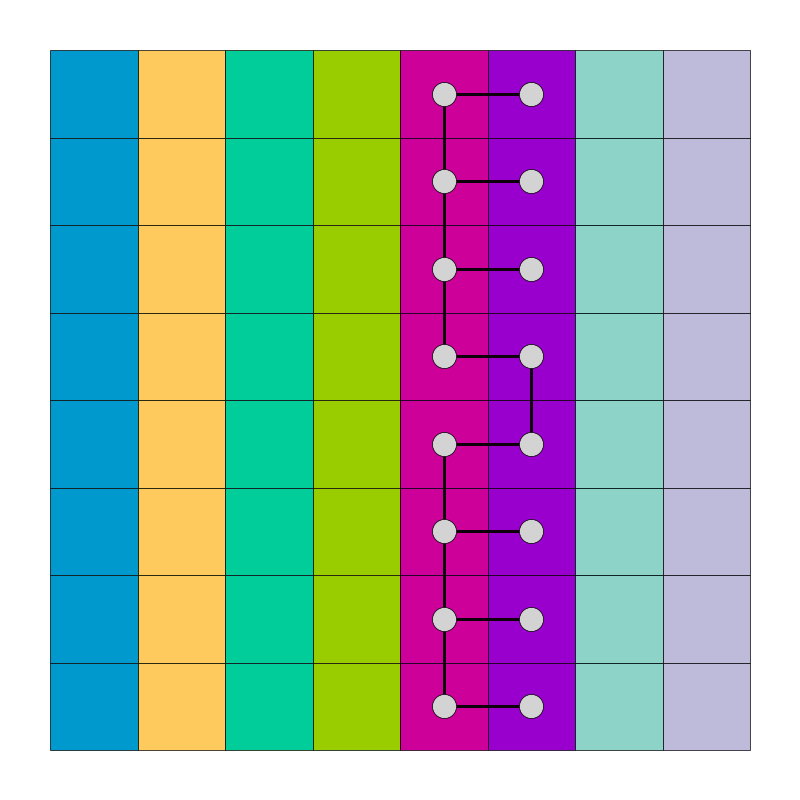
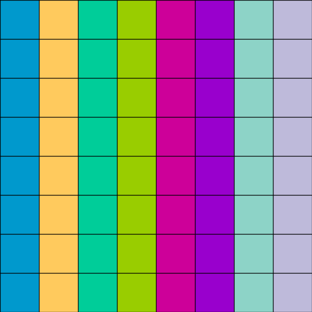
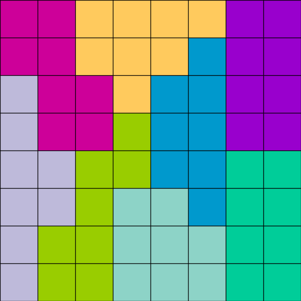

==========================
Running a chain with ReCom
==========================

Our goal now is to get a handle on using GerryChain to run Markov chains with
both regular and region-aware settings. Throughout this guide, we'll use the
toy state of GerryMandria, which has needs to be divided into 8 districts.

The legislature of the state of GerryMandria has provided us with the
following districting plan:

.. image:: ./images/gerrymandria.png
    :width: 400px
    :align: center

which has corresponding dual graph given by:

.. image:: ./images/gerrymandria_district.png
    :width: 400px
    :align: center

``gerrychain`` works primarily with the dual graph of the districting plan. The
remaining maps use the equivalent grid layout so that the changing districts
and the regions they intersect are easier to compare.

A Simple Recom Chain
====================

.. raw:: html

    

      <a href="https://github.com/mggg/GerryChain/tree/main/docs/_static/gerrymandria.json" class="download-badge" download>
        Download GerryMandria File
      </a>
    

     

Let us start by running a simple ReCom chain on this districting plan. Of course,
the first thing to do is to import the required packages:

.. code-block:: python

    from gerrychain import (Partition, Graph, MarkovChain,
                            updaters, constraints, accept)
    from gerrychain.proposals import build_recom_proposal_fn
    from gerrychain.constraints import contiguous
    from functools import partial
    import pandas

Now we set up the initial partition:

.. code-block:: python 

    graph = Graph.from_json("./gerrymandria.json")

    my_updaters = {
        "population": updaters.Tally("TOTPOP"),
        "cut_edges": updaters.cut_edges
    }

    initial_partition = Partition(
        graph,
        assignment="district",
        updaters=my_updaters
    )

And we make the proposal:

.. code-block:: python

    # This should be 8 since each node has population 1 and each district has 8 nodes.
    # Note that the key "population" corresponds to the population updater
    # that we defined above and not with the population column in the json file.
    ideal_population = sum(initial_partition["population"].values()) / len(initial_partition)

    my_proposal = build_recom_proposal_fn(
        pop_col="TOTPOP",
        pop_target=ideal_population,
        epsilon=0.01,
    )

We can now set up the chain:

.. code-block:: python

    recom_chain = MarkovChain(
        proposal=my_proposal,
        constraints=[contiguous],
        accept=accept.always_accept,
        initial_state=initial_partition,
        total_steps=40,
        rng=2024,
    )

and run it, collecting the assigment for each step, so that we can
watch the chain work in a fun animation (of course, it would be a
bad idea to do this for a chain with a large number of steps).

.. code-block:: python

  assignment_list = []

  for i, item in enumerate(recom_chain):
      assignment_list.append(item.assignment)

To create the animation, we need to define some functions to do 
the animation.  If the way these functions work is not clear, 
don't worry about it - they are just a way to show you how 
recom works.

.. code-block:: python

    import numpy as np
    import matplotlib.pyplot as plt
    import math   
    import io     
    from matplotlib.colors import ListedColormap
    from PIL import Image
    from IPython.display import display, clear_output

    DISTRICTR_COLORS = [
        "#0099cd", "#ffca5d", "#00cd99", "#99cd00",
        "#cd0099", "#9900cd", "#8dd3c7", "#bebada",
    ]

    # Define a function to "plot" a GerryChain assignment but as an image
    # to be displayed later.
    #
    def plot_assignment_to_image(this_assignment):

        # Create a grid (numpy array) with district ids (integers)
        # to use withi matplotlib to plot the assignment

        # Assumes a square grid (graph)
        grid_size = math.isqrt(len(this_assignment))

        grid = np.empty((grid_size,grid_size))

        # Get (x,y) position from each node in the graph
        # and set grid value for that position to the district_id
        for node_id, district_id in this_assignment.items():
            x_pos = graph.node_data(node_id)['x']
            y_pos = graph.node_data(node_id)['y']
            grid_pos = (y_pos, x_pos)
            grid[grid_pos] = district_id

        fig, ax = plt.subplots(figsize=(grid_size+1, grid_size+1))
        im = ax.imshow(grid, cmap=ListedColormap(DISTRICTR_COLORS))

        ax.set_xticks(np.arange(-0.5, grid_size, 1), minor=True)
        ax.set_yticks(np.arange(-0.5, grid_size, 1), minor=True)

        ax.grid(which='minor', color='black', linestyle='-', linewidth=1)

        # Hide the numeric labels (axis values)
        ax.set_xticklabels([])
        ax.set_yticklabels([])

        buffer = io.BytesIO()
        plt.savefig(buffer, format='png')
        buffer.seek(0)
        image = Image.open(buffer)
        plt.close(fig)
        return image

And now let's check to make sure that it works by plotting an
arbitrary assignment - say, assignment_list[35]

.. code-block:: python

    saved_district_plan = plot_assignment_to_image(assignment_list[35])
    display(saved_district_plan)

And now another utility routine to display a sequence of assignments
in a way that you can explore, by going forward and backward in the
sequence - to see what GerryChain did at each step.

Note that the plot does not change at every step - this is because
sometimes recom splits a merged pair of districts in exactly the 
same way that the districts were before being merged, which looks
like nothing happened.

.. code-block:: python

    from io import BytesIO

    import ipywidgets as widgets
    from IPython.display import display

    def image_to_png(image):
        """Convert a Pillow image into the PNG bytes expected by widgets.Image."""
        # BytesIO acts like an in-memory file, avoiding temporary image files.
        with BytesIO() as buffer:
            image.save(buffer, format="PNG")
            return buffer.getvalue()

    def create_assignment_images(assignment_list):
        """Render each district assignment once and store it as PNG bytes."""
        # Pre-rendering makes moving between plans faster and reduces flickering.
        return [
            image_to_png(plot_assignment_to_image(assignment))
            for assignment in assignment_list
        ]

    def create_assignment_viewer(image_list):
        """Display controls for moving forward and backward through district plans."""
        if not image_list:
            raise ValueError("image_list must contain at least one image")

        # This slider stores the current image index. It is not displayed directly,
        # but changing its value provides one shared way to update the viewer.
        step = widgets.IntSlider(
            value=0,
            min=0,
            max=len(image_list) - 1,
            continuous_update=False,
            readout=False,
        )

        # Mount the widgets
        label = widgets.HTML()
        image = widgets.Image(
            value=image_list[0],
            format="png",
            layout=widgets.Layout(width="100%"),
        )

        back = widgets.Button(
            description="◀ Back",
            button_style="primary",
        )
        forward = widgets.Button(
            description="Forward ▶",
            button_style="primary",
        )

        def update(change=None):
            """Update the displayed image and its step counter."""
            index = step.value
            image.value = image_list[index]
            label.value = (
                f"<b>District Plan {index + 1} of {len(image_list)}</b>"
            )

        def go_back(button):
            # The modulo operation wraps from the first plan to the last plan.
            step.value = (step.value - 1) % len(image_list)

        def go_forward(button):
            # Likewise, moving forward from the last plan returns to the first.
            step.value = (step.value + 1) % len(image_list)

        # Button clicks change the step. The observer then calls update().
        back.on_click(go_back)
        forward.on_click(go_forward)
        step.observe(update, names="value")

        # Arrange the label and image vertically, with the buttons side by side.
        viewer = widgets.VBox(
            [
                label,
                image,
                widgets.HBox([back, forward]),
            ],
            layout=widgets.Layout(
                align_items="center",
                width="50%",
            ),
        )

        # Populate the widgets with the first image before displaying them.
        update()
        display(viewer)

.. code-block:: python

    assignment_images = create_assignment_images(assignment_list)
    create_assignment_viewer(assignment_images)

And this should generate a little widget that you can move through to see the chain
in action! Here is a gif of what it should look like:

The plan may stay unchanged at some steps. ReCom can reconstruct the same split after merging two
districts, and constraints or the acceptance function can also produce a self-loop. These repeated
states are part of the Markov chain and can carry statistical importance, so they should generally
not be removed from the ensemble.

Region-Aware ReCom
==================

Of course, in the state of GerryMandria, the legislature has decided that it would like
to try to keep the municipality of Gerryville together in a single district. In fact, it would
really prefer to keep all of the municipalities together if possible, and, as such any analysis
that you do needs to be on a ensemble of districting plans that try to keep municipalities 
together. Here is a picture of the municipalities in GerryMandria:

.. image:: ./images/gerrymandria_cities.png
    :width: 400px
    :align: center

Fortunately, ``gerrychain`` has a built-in functionality that allows for
region-aware ReCom chains which create ensembles
of districting plans that try to keep particular regions of interest together.
And it only takes one extra line of code: we simply update
our proposal to include a ``region_surcharge`` which increases the importance of the
edges within the municipalities.

.. code-block:: python

    my_proposal_2 = build_recom_proposal_fn(
        pop_col="TOTPOP",
        pop_target=ideal_population,
        epsilon=0.01,
        region_surcharge={"muni": 0.5},
    )
    
    recom_chain = MarkovChain(
        proposal=my_proposal_2,
        constraints=[contiguous],
        accept=accept.always_accept,
        initial_state=initial_partition,
        total_steps=40,
        rng=2025,
    )

    assignment_list = []

    for i, item in enumerate(recom_chain):
        assignment_list.append(item.assignment)

And then plot them

.. code-block:: python

    assignment_images = create_assignment_images(assignment_list)
    create_assignment_viewer(assignment_images)

And this will produce the following ensemble:

Now, the legislature of GerryMandria has decided that it would also like to try
to keep the counties together as well. They mention to you that it would be nice
to keep the municipalities together, but that it is more important to keep the
water districts together. Here is a picture of the water districts in GerryMandria:

.. image:: ./images/gerrymandria_water.png
    :width: 400px
    :align: center

Notice that there is a river that seems to cut through the middle of the state,
and so it is not going to be possible to keep all of the water districts together
and all of the municipalities together in one plan. However, we can try to keep
the water districts together as much as possible, and then, within those water
districts, try to be sensitive to the boundaries of the municipalities. Again, 
this only requires for us to edit the ``region_surcharge`` parameter of the proposal

.. code-block:: python

    my_proposal_3 = build_recom_proposal_fn(
        pop_col="TOTPOP",
        pop_target=ideal_population,
        epsilon=0.01,
        region_surcharge={"muni": 0.2, "water_dist": 0.8},
    )

Since we are trying to be sensitive to multiple bits of information, we should probably
also increase the length of our chain to make sure that we have time to mix properly.

.. code-block:: python

    recom_chain = MarkovChain(
        proposal=my_proposal_3,
        constraints=[contiguous],
        accept=accept.always_accept,
        initial_state=initial_partition,
        total_steps=200,
        rng=2026,
    )

    assignment_list = []

    for i, item in enumerate(recom_chain):
        if (i%100 == 0):
            print(f"\rDoing step {i}...", end="", flush=True)
        assignment_list.append(item.assignment)

And plot the last 40 assignments.

.. code-block:: python

    assignments_to_plot = assignment_list[-40:]
    assignment_images = create_assignment_images(assignments_to_plot)
    create_assignment_viewer(assignment_images)

Taking the last 40 states reduces the visible influence of the initial plan and allows us to see
the effect of the surcharges on the preservation of the municipalities and water districts. Since
this graph is small, 200 steps is enough to show the effects, but a real statistical analysis would
require a much longer chain.

Comparing the last map with the municipality and water district maps, we can see
that the chain has done a pretty good job of keeping the water districts together
while also being sensitive to the municipalities

.. figure:: ./images/gerrymandria_water_and_muni_aware.png
    :width: 400px
    :align: center

    The last map in the ensemble from the 200-step region-aware ReCom chain with
    surcharges of 0.2 for the municipalities and 0.8 for the water districts.

.. raw:: html

   

       <figure style="text-align: center;">
           
           <figcaption><em>Municipalities of Gerrymandria</em></figcaption>
       </figure>
       <figure style="text-align: center;">
           
           <figcaption><em>Water Districts of GerryMandria</em><figcaption>
       </figure>
   

How the Region Aware Implementation Works
-----------------------------------------

When working with region-aware ReCom chains, it is worth knowing how the spanning tree
of the dual graph is being split. Weights from the interval :math:`[0,1]` are randomly
assigned to the edges of the graph and then the surcharges are applied to the edges in
the graph that span different regions specified by the ``region_surcharge`` dictionary.
So if we have ``region_surcharge={"muni": 0.2, "water_dist": 0.8}``, then the edges that
span different municipalities will be upweighted by 0.2 and the edges that span different
water districts will be upweighted by 0.8. We then draw a minimum spanning tree using
by greedily selecting the lowest-weight edges via Kruskal's algorithm. The surcharges on
the edges helps ensure that the algorithm picks the edges interior to the region
before it picks the edges that bridge different regions. 

This makes it very likely that each region is largely contained in a connected subtree
attached to a bridge node. Thus, when we make a cut, the regions attached to the
bridge node are more likely to be (mostly) preserved in the subtree on either side
of the cut.

In the implementation of :meth:`~gerrychain.tree.bipartition_tree` we further bias this
choice by deterministically cutting bridge edges first (when possible). In the event that
multiple types of regions are specified, the surcharges are added together, and edges are
selected first by the number of types of regions that they span, and then by the
surcharge added to those weights. So, if we have a region surcharge dictionary of
``{"a": 1, "b": 4, "c": 2}`` then edges which bridge all three regions, "a", "b", and "c", 
would be cut first (total weight of 7), and then edges which bridge regions, "b" and "c" 
(total weight of 6), etc.  So, the order in which edges would be selected would be:

- ("a", "b", "c")
- ("b", "c")
- ("a", "b")
- ("a", "c")
- ("b")
- ("c")
- ("a")
- the maximum-weight fallback

In the event that this is not the desired behaviour, for instance, if the user 
would like to pick an edge at random, then the user can alter the ``cut_choice_fn``
function used by the bipartition_tree_fn which will
tell the bipartition_tree_fn to use a criteria for picking which 
edge to cut which is different from the default described above.  

Because the build_recom_proposal_fn expects a function reference for the 
value of its "bipartition_tree_fn", we need to create a new function 
using Python's ``functools.partial()`` that will bind the cut_choice_fn to
be used by the bipartition_tree_fn. GerryChain supplies the chain-owned RNG automatically:

.. code-block:: python

    from gerrychain.tree import bipartition_tree
    from functools import partial

    def choose_random_cut(cuts, *, rng):
        """Choose one balanced cut uniformly at random."""
        return rng.choice(cuts)

    my_new_bipartition_tree_fn = partial(
        bipartition_tree,
        cut_choice_fn=choose_random_cut,
    )

For those of you for whom ``functools.partial()`` is a new concept:

.. admonition:: Use of ``functools.partial``
  :class: note

  The ``functools.partial`` function allows us to create a new function from
  an existing function by binding the values of some of the arguments. For example,
  we might have a function to make a colored square:

  .. code-block:: python

    from PIL import Image

    def make_color_square(red_val, green_val, blue_val):
        img = Image.new('RGB', (100, 100), color = (red_val, green_val, blue_val))
        return img

  And we can then use this to make a new function that always makes a blue square:

  .. code-block:: python

    make_blue_square = partial(make_color_square, red_val=0, green_val=0)

    make_color_square(red_val=255, green_val=0, blue_val=0).show() # Makes a red square
    make_blue_square(blue_val=255).show() # Makes a blue square

And we can then build our proposal as follows:

.. code-block:: python

    from gerrychain.tree import bipartition_tree

    my_proposal_4 = build_recom_proposal_fn(
        pop_col="TOTPOP",
        pop_target=ideal_population,
        epsilon=0.01,
        region_surcharge={
            "muni": 0.2,
            "water_dist": 0.8,
        },
        bipartition_tree_fn=my_new_bipartition_tree_fn,
    )

    recom_chain = MarkovChain(
        proposal=my_proposal_4,
        constraints=[contiguous],
        accept=accept.always_accept,
        initial_state=initial_partition,
        total_steps=200,
        rng=2027,
    )

    assignment_list = []

    for i, item in enumerate(recom_chain):
        if (i%100 == 0):
            print(f"\rDoing step {i}...", end="", flush=True)
        assignment_list.append(item.assignment)

And plot the last 40 assignments.

.. code-block:: python

    assignments_to_plot = assignment_list[-40:]
    assignment_images = create_assignment_images(assignments_to_plot)
    create_assignment_viewer(assignment_images)

Surcharges should be interpreted relative to the base random edge weights in :math:`[0,1)`.
Since the standard ``random()`` method of Python's built-in ``random`` module outputs
values in :math:`[0,1)`, surcharges closer to 1 will have a stronger effect on region preservation
compared to surcharges closer to 0. Surcharges above 1 are allowed (as shown below), but they do 
not have any stronger effect than a surcharge of 1.

What to do if the Chain Gets Stuck
==================================

Sometimes, either because of the constraints that you have imposed or because of
the shape of the graph that you are working with, a recom chain can get stuck and
will throw an error. For example, if we try to be a bit too demanding of the 
region-aware chain given above
and ask for a plan that effectively never splits a municipality nor a water
district, then the chain will get stuck and throw an error. Here is the setup:

.. code-block:: python

    from gerrychain import (Partition, Graph, MarkovChain,
                            updaters, constraints, accept)
    from gerrychain.proposals import build_recom_proposal_fn
    from gerrychain.tree import bipartition_tree
    from gerrychain.constraints import contiguous
    from functools import partial

    graph = Graph.from_json("./gerrymandria.json")

    my_updaters = {
        "population": updaters.Tally("TOTPOP"),
        "cut_edges": updaters.cut_edges
    }

    initial_partition = Partition(
        graph,
        assignment="district",
        updaters=my_updaters
    )

    ideal_population = sum(initial_partition["population"].values()) / len(initial_partition)

    my_proposal_5 = build_recom_proposal_fn(
        pop_col="TOTPOP",
        pop_target=ideal_population,
        epsilon=0.01,
        region_surcharge={
            "muni": 2.0,
            "water_dist": 2.0,
        },
        bipartition_tree_fn=partial(
            bipartition_tree,
            max_attempts=100,
            warn_attempts=50,
        ),
    )

    recom_chain = MarkovChain(
        proposal=my_proposal_5,
        constraints=[contiguous],
        accept=accept.always_accept,
        initial_state=initial_partition,
        total_steps=20,
        rng=0,
    )

    assignment_list = []
    for item in recom_chain:
        assignment_list.append(item.assignment)

This deterministic example emits a warning and then raises an error:

.. code-block:: console

    BipartitionWarning:
    Failed to find a balanced cut after 50 attempts.

    RuntimeError: Could not find a possible cut after 100 attempts.

Here, ``max_attempts`` is the total number of balanced-cut searches for the selected pair of
districts. ``node_repeats`` is the number of additional roots tried on each spanning tree, so a
tree is searched ``node_repeats + 1`` times. With the default memoized cut finder, each search
already examines every edge in the tree. Re-rooting cannot make an uncuttable tree cuttable, so
the default ``node_repeats=0`` redraws immediately, and setting it above zero with the memoized 
finder emits a warning. Positive values remain useful with the contraction finder or a custom 
cut-edge finder whose result can depend on the root choice.

The hard regional surcharges can still make a particular district pair difficult to split. Pair
reselection lets ReCom try another adjacent pair after exhausting the budget:

.. code-block:: python

    my_proposal_7 = build_recom_proposal_fn(
        pop_col="TOTPOP",
        pop_target=ideal_population,
        epsilon=0.01,
        region_surcharge={
            "muni": 2.0,
            "water_dist": 2.0,
        },
        bipartition_tree_fn=partial(
            bipartition_tree,
            max_attempts=100,
            warn_attempts=50,
            allow_pair_reselection=True,
        ),
    )

    recom_chain = MarkovChain(
        proposal=my_proposal_7,
        constraints=[contiguous],
        accept=accept.always_accept,
        initial_state=initial_partition,
        total_steps=20,
        rng=0,
    )

    assignment_list = [item.assignment for item in recom_chain]

This chain completes all 20 steps because it can move on from an unsuitable district pair.

A Real-World Example
====================

In this example, we'll use GerryChain to analyze Pennsylvania's 2011 congressional districting
plan. We'll compare the partisan vote
shares in the 2011 plan to those in an ensemble of districting plans generated
by our ReCom chain.

Imports
-------

As always, the first step is to import everything we need

.. code-block:: python

    import matplotlib.pyplot as plt
    from gerrychain import (GeographicPartition, Partition, Graph, MarkovChain,
                            proposals, updaters, constraints, accept, Election)
    from gerrychain.proposals import build_recom_proposal_fn
    from functools import partial
    import pandas

Setting up the initial districting plan
---------------------------------------

.. raw:: html

    

      <a href="https://github.com/mggg/GerryChain/tree/main/docs/_static/PA_VTDs.json" class="download-badge" download>Download PA File</a>
    

     

We'll create our graph using the example Pennsylvania json file.

.. code-block:: python

    graph = Graph.from_json("./PA_VTDs.json")

We may now configure :class:`~gerrychain.Election` objects representing some of 
the election data from our file.

.. code-block:: python

    elections = [
        Election("SEN10", {"Democratic": "SEN10D", "Republican": "SEN10R"}),
        Election("SEN12", {"Democratic": "USS12D", "Republican": "USS12R"}),
        Election("SEN16", {"Democratic": "T16SEND", "Republican": "T16SENR"}),
        Election("PRES12", {"Democratic": "PRES12D", "Republican": "PRES12R"}),
        Election("PRES16", {"Democratic": "T16PRESD", "Republican": "T16PRESR"})
    ]
    

Configuring our updaters
++++++++++++++++++++++++

We want to set up updaters for everything we want to compute for each plan in the ensemble. 
In this case, we want to keep track of the population of each district and election info
for each of our previously defined elections.

.. code-block:: python
    
    # Population updater, for computing how close to equality the district
    # populations are. "TOTPOP" is the population column from our shapefile.
    my_updaters = {"population": updaters.Tally("TOT_POP", alias="population")}
    
    # Election updaters, for computing election results using the vote totals
    # from our shapefile.
    election_updaters = {election.name: election for election in elections}
    my_updaters.update(election_updaters)

Instantiating the partition
+++++++++++++++++++++++++++

We can now instantiate the initial state of our Markov chain, using the 2011 districting plan

.. code-block:: python

    initial_partition = GeographicPartition(
        graph, 
        assignment="2011_PLA_1", 
        updaters=my_updaters
    )
    
The class :class:`~gerrychain.GeographicPartition` comes with built-in ``area`` and 
``perimeter`` updaters. We do not use them here since (i) the \*.json file that we 
are working with does not have geometric information and (ii) geometric updaters tend
to slow the chain quite considerably (and this is just an example), but they would 
allow us to compute compactness scores like Polsby-Popper that depend on these 
measurements.

Setting up the Markov chain
---------------------------

Proposal
++++++++

First we'll set up the ReCom proposal. To do this we will need to make use of the python
`functools`_ package, specifically the ``partial`` function within this package. 

.. code-block:: python

    # The ReCom proposal needs to know the ideal population for the districts so that
    # we can improve speed by bailing early on unbalanced partitions.
    
    ideal_population = sum(initial_partition["population"].values()) / len(initial_partition)
    
    proposal = build_recom_proposal_fn(
        pop_col="TOT_POP",
        pop_target=ideal_population,
        epsilon=0.02,
    )

Constraints
+++++++++++

To keep districts about as compact as the original plan, we would like to
constrain the number of cut edges between all of the districts (this will
keep our districts from being too snake-like).
We can do this using the :class:`~gerrychain.constraints.UpperBound` constraint,
and, as a general heuristic, we'll bound the number of cut edges by twice the
number of cut edges in the initial plan.

.. code-block:: python
    
    def cut_edges_length(p):
      return len(p["cut_edges"])

    compactness_bound = constraints.UpperBound(
      cut_edges_length,
      2*len(initial_partition["cut_edges"])
    )

    pop_constraint = constraints.within_percent_of_ideal_population(initial_partition, 0.02)

.. admonition:: Coding Note
  :class: note

  We can simplify the calling of this compactness bound using lambda functions.

  .. code-block:: python

    compactness_bound = constraints.UpperBound(
      lambda p: len(p["cut_edges"]),
      2*len(initial_partition["cut_edges"])
    )

  The use of lambda functions tends to be a more advanced coding technique, but
  the benefit is that we do not need to define a new function for each constraint
  that we want to use, and they can make the code more readable.

Configuring the Markov chain
++++++++++++++++++++++++++++

.. code-block:: python

    chain = MarkovChain(
        proposal=proposal,
        constraints=[
            pop_constraint,
            compactness_bound
        ],
        accept=accept.always_accept,
        initial_state=initial_partition,
        total_steps=1000,
        rng=2024,
    )

Running the chain
-----------------

Now we'll run the chain, putting the sorted Democratic vote percentages directly
into a :mod:`pandas` :class:`~pandas.DataFrame` for analysis and plotting. The ``DataFrame``
will have a row for each state of the chain. The first column of the ``DataFrame`` will
hold the lowest Democratic vote share among the districts in each partition in the chain, the
second column will hold the second-lowest Democratic vote shares, and so on.

.. code-block:: python

    # This might take a few minutes.
    
    data = pandas.DataFrame(
        sorted(partition["SEN12"].percents("Democratic"))
        for partition in chain
    )

If you are wondering what the ``for`` loop inside of the parentheses
is doing, please see the `this note <./quickstart.html#list-comprehension>`_.
If you install the ``tqdm`` package, you can see a progress bar
as the chain runs by running this code instead

.. code-block:: python
    
    data = pandas.DataFrame(
        sorted(partition["SEN12"].percents("Democratic"))
        for partition in chain.with_progress_bar()
    )

Create a plot
-------------

Now we'll create a box plot to help visualize the data report.

.. code-block:: python

    fig, ax = plt.subplots(figsize=(8, 6))

    # Draw 50% line
    ax.axhline(0.5, color="#cccccc")

    # Draw boxplot
    data.boxplot(ax=ax, positions=range(len(data.columns)))

    # Draw initial plan's Democratic vote %s (.iloc[0] gives the first row)
    plt.plot(data.iloc[0], "ro")

    # Annotate
    ax.set_title("Comparing the 2011 plan to an ensemble")
    ax.set_ylabel("Democratic vote % (Senate 2012)")
    ax.set_xlabel("Sorted districts")
    ax.set_ylim(0, 1)
    ax.set_yticks([0, 0.25, 0.5, 0.75, 1])

    plt.show()

.. image:: ./images/recom_plot.svg

The exact plot is reproducible when the input data, GerryChain version, configuration, and seed
are all the same. Different seeds produce different valid random samples. This short chain is an
illustration of the workflow, not evidence by itself for a legal or statistical conclusion.

There you go! To build on this, here are some possible next steps:

* Add, remove, or tweak the constraints
* Perform a similar analysis on a different districting plan for Pennsylvania
* Perform a similar analysis on a different state
* Compute partisan symmetry scores like Efficiency Gap or Mean-Median, and
  create a histogram of the scores of the ensemble.
* Perform the same analysis using a different election than the 2012 Senate election
* Collect Democratic vote percentages for *all* the elections we set up, instead
  of just the 2012 Senate election.

.. _functools: https://docs.python.org/3/library/functools.html
