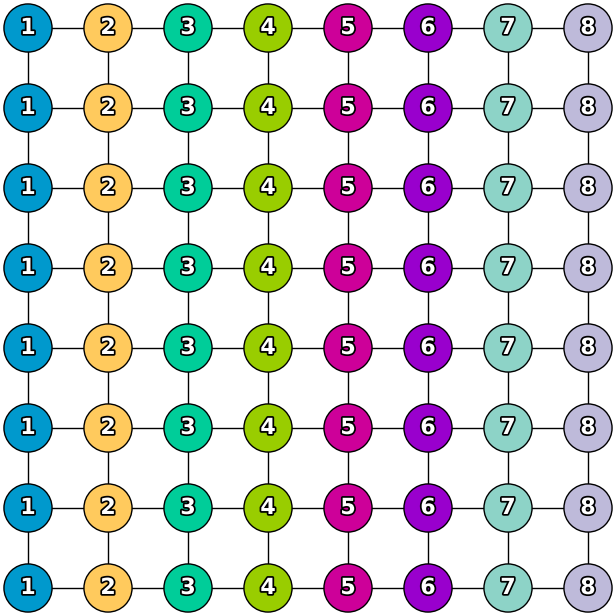
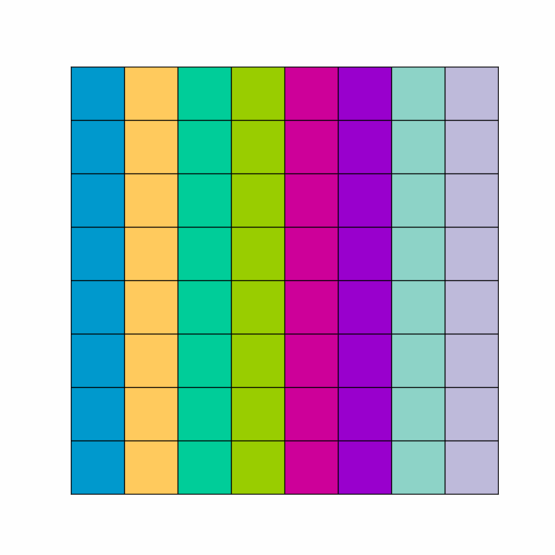
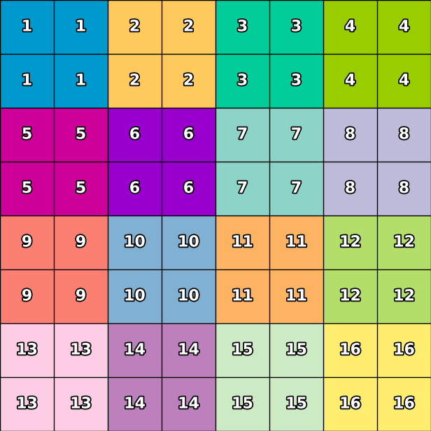
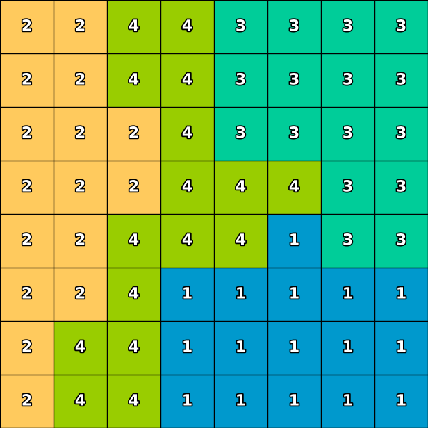
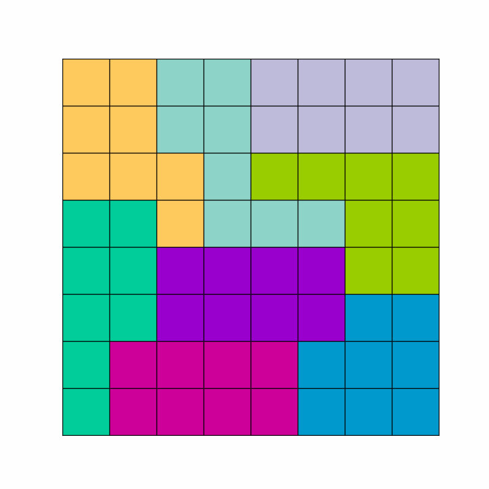
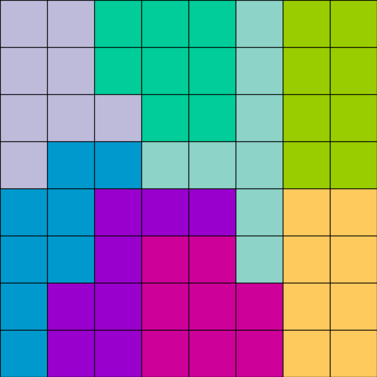
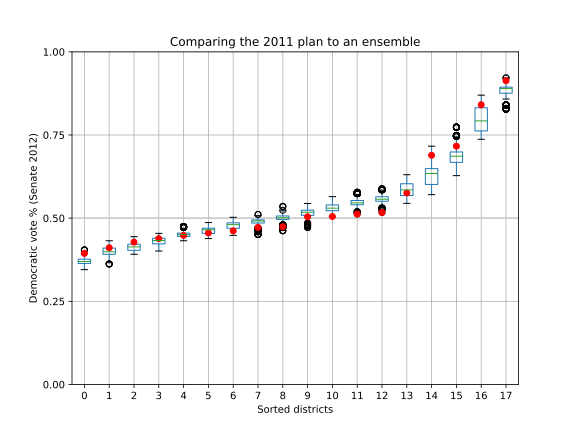

==========================
Running a chain with ReCom
==========================

Our goal now is to get a handle on using GerryChain to run Markov chains with
both regular and region-aware settings. Throughout this guide, we'll use the
toy state of GerryMandria, which has needs to be divided into 8 districts.

The legislature of the state of GerryMandria has provided us with the
following districting plan:

which has corresponding dual graph given by:

``gerrychain`` works primarily with the dual graph of the districting plan, so
all of the pictures in this guide will use the dual graph as well.

A Simple Recom Chain
====================

.. raw:: html

    

      <a href="https://github.com/mggg/GerryChain/tree/main/docs/_static/gerrymandria.json" class="download-badge" download>
        Download GerryMandria File
      </a>
    

     

Let us start by running a simple ReCom chain on this districting plan. Of course,
the first thing to do is to import the required packages:

.. code-block:: python

    from gerrychain import (Partition, Graph, MarkovChain,
                            updaters, constraints, accept)
    from gerrychain.proposals import recom, build_recom_proposal_fn
    from gerrychain.constraints import contiguous
    from functools import partial
    import pandas

    # Set the random seed so that the results are reproducible!
    import random
    random.seed(2024)

Now we set up the initial partition:

.. code-block:: python 

    graph = Graph.from_json("./gerrymandria.json")

    my_updaters = {
        "population": updaters.Tally("TOTPOP"),
        "cut_edges": updaters.cut_edges
    }

    initial_partition = Partition(
        graph,
        assignment="district",
        updaters=my_updaters
    )

And we make the proposal:

.. code-block:: python

    # This should be 8 since each district has 1 person in it.
    # Note that the key "population" corresponds to the population updater
    # that we defined above and not with the population column in the json file.
    ideal_population = sum(initial_partition["population"].values()) / len(initial_partition)

    my_proposal = build_recom_proposal_fn(
        pop_col="TOTPOP",
        pop_target=ideal_population,
        epsilon=0.01,
        node_repeats=2
    )

We can now set up the chain:

.. code-block:: python

    recom_chain = MarkovChain(
        proposal=my_proposal,
        constraints=[contiguous],
        accept=accept.always_accept,
        initial_state=initial_partition,
        total_steps=40
    )

and run it, collecting the assigment for each step, so that we can
watch the chain work in a fun animation (of course, it would be a
bad idea to do this for a chain with a large number of steps).

.. code-block:: python

  assignment_list = []

  for i, item in enumerate(recom_chain):
      assignment_list.append(item.assignment)

To create the animation, we need to define some functions to do 
the animation.  If the way these functions work is not clear, 
don't worry about it - they are just a way to show you how 
recom works.

.. code-block:: python

    import numpy as np
    import matplotlib.pyplot as plt
    import math   
    import io     
    from PIL import Image
    from IPython.display import display, clear_output

    # Define a function to "plot" a GerryChain assignment but as an image
    # to be displayed later.
    #
    def plot_assignment_to_image(this_assignment):

        # Create a grid (numpy array) with district ids (integers)
        # to use withi matplotlib to plot the assignment

        # Assumes a square grid (graph)
        grid_size = math.isqrt(len(this_assignment))

        grid = np.empty((grid_size,grid_size))

        # Get (x,y) position from each node in the graph
        # and set grid value for that position to the district_id
        for node_id, district_id in this_assignment.items():
            x_pos = graph.node_data(node_id)['x']
            y_pos = graph.node_data(node_id)['y']
            grid_pos = (x_pos, y_pos)
            grid[grid_pos] = district_id

        fig, ax = plt.subplots(figsize=(grid_size+1, grid_size+1))
        im = ax.imshow(grid, cmap='viridis')

        ax.set_xticks(np.arange(-0.5, grid_size, 1), minor=True)
        ax.set_yticks(np.arange(-0.5, grid_size, 1), minor=True)

        ax.grid(which='minor', color='black', linestyle='-', linewidth=1)

        # Hide the numeric labels (axis values)
        ax.set_xticklabels([])
        ax.set_yticklabels([])

        buffer = io.BytesIO()
        plt.savefig(buffer, format='png')
        buffer.seek(0)
        image = Image.open(buffer)
        plt.close(fig)
        return image

And now let's check to make sure that it works by plotting an
arbitrary assignment - say, assignment_list[35]

.. code-block:: python

    saved_district_plan = plot_assignment_to_image(assignment_list[35])
    display(saved_district_plan)

And now another utility routine to display a sequence of assignments
in a way that you can explore, by going forward and backward in the
sequence - to see what GerryChain did at each step.

Note that the plot does not change at every step - this is because
sometimes recom splits a merged pair of districts in exactly the 
same way that the districts were before being merged, which looks
like nothing happened.

.. code-block:: python

    %matplotlib inline
    import matplotlib_inline.backend_inline
    import matplotlib.cm as mcm
    import matplotlib.pyplot as plt
    import networkx as nx
    from PIL import Image
    import io
    import ipywidgets as widgets
    import ipywidgets as widgets
    from IPython.display import display, clear_output

    def create_assignment_images(assignment_list):

        image_list = []
        
        for i in range(len(assignment_list)):
            image_list.append(
                plot_assignment_to_image(assignment_list[i])
            )

        return image_list

    # frm: TODO: Peter: Please feel free to change this code!!!
    # 
    # I found it on the web and hacked it until it worked for this case,
    # but I am sure there are more elegant ways to do this.  
    #
    # What I was trying to do was make it easier for the user to understand
    # what was going on with recom - the nodes and edges presentation was
    # vidually noisy, and the slider was awkward - so I went with just a 
    # colored grid with forward and back buttons.
    #
    # Note that this made it obvious that sometimes recom doesn't change the 
    # state of the plan, so I added some verbiage to explain why that might 
    # be the case.

    def create_assignment_viewer(image_list):
        """
        Creates and displays an interactive image viewer with Back and Forward buttons.
        
        Parameters:
        - image_list (list): A list of local images.
        """
        num_images = len(image_list)
        first_image_index = 0
        last_image_index = num_images - 1

        # Track the index locally inside the function scope
        state = {'current_index': 0}

        # Create UI components
        output_widget = widgets.Output()
        button_back = widgets.Button(description="◀ Back", button_style='primary')
        button_forward = widgets.Button(description="Forward ▶", button_style='primary')

        def update_image():
            with output_widget:
                output_widget.clear_output(wait=True)
                idx = state['current_index']
                
                # Show current step indicator
                print(f"\nDistrict Plan (assignment) {idx + 1} of {len(image_list)}")
                
                # Update button states
                button_back.disabled = (state['current_index'] == first_image_index)
                button_forward.disabled = (state['current_index'] == last_image_index)

                # Display the actual image file
                display(image_list[idx])

        def on_back_click(b):
            if state['current_index'] > 0:
                state['current_index'] -= 1
                update_image()

        def on_forward_click(b):
            if state['current_index'] < len(image_list) - 1:
                state['current_index'] += 1
                update_image()

        # Bind click events
        button_back.on_click(on_back_click)
        button_forward.on_click(on_forward_click)

        # Render layout layout and initialize first image
        controls = widgets.HBox([button_back, button_forward])
        v_box_layout = widgets.Layout(
            display='flex',
            flex_flow='column',
            align_items='center', # This aligns items along the cross-axis (horizontally)
            width='50%'
        )
        viewer_layout = widgets.VBox([output_widget, controls], layout = v_box_layout)
        display(viewer_layout)
        
        update_image()

.. code-block:: python

    assignment_images = create_assignment_images(assignment_list)
    create_assignment_viewer(assignment_images)

And this should generate a little widget that you can move through to see the chain
in action! Here is a gif of what it should look like:

frm: TODO: Clarity...  Explain why the plot might not change every iteration.
Ideally the user would be able to step through the chain in his/her own time with
a forward and back button - because it is actually disorienting to have the gif
go at its own pace.  If you allowed the user to go forward and back with buttons, however,
they would notice that sometimes the plot does not change and this might make them 
wonder what is going on.  The answer is that recom works by 1) randomly choosing which
adjacent districts to merge and then 2) randomly picking a way to split them.  This 
means that the code might split the merged districts exactly the way they were split 
before the merge - in which case it would appear that nothing happened.

I would ague that this is in fact a bug in the code - at least from a statistical POV 
because you want to explore all possible plans and this will give you the same plan over 
and over sometimes (if there are few ways to split a given combined region).  Perhaps this
could be solved by removing duplicates after a run...

Region-Aware ReCom
==================

Of course, in the state of GerryMandria, the legislature has decided that it would like
to try to keep the municipality of Gerryville together in a single district. In fact, it would
really prefer to keep all of the municipalities together if possible, and, as such any analysis
that you do needs to be on a ensemble of districting plans that try to keep municipalities 
together. Here is a picture of the municipalities in GerryMandria:

Fortunately, ``gerrychain`` has a built-in functionality that allows for
region-aware ReCom chains which create ensembles
of districting plans that try to keep particular regions of interest together.
And it only takes one extra line of code: we simply update
our proposal to include a ``region_surcharge`` which increases the importance of the
edges within the municipalities.

.. code-block:: python

    my_proposal_2 = build_recom_proposal_fn(
        pop_col="TOTPOP",
        pop_target=ideal_population,
        epsilon=0.01,
        node_repeats=2,
        region_surcharge={"muni": 1.0},
    )
    
    recom_chain = MarkovChain(
        proposal=my_proposal_2,
        constraints=[contiguous],
        accept=accept.always_accept,
        initial_state=initial_partition,
        total_steps=40
    )

    assignment_list = []

    for i, item in enumerate(recom_chain):
        assignment_list.append(item.assignment)

And then plot them

.. code-block:: python

    assignment_images = create_assignment_images(assignment_list)
    create_assignment_viewer(assignment_images)

    # frm: TODO: Think about whether code is now fragile.  This blew up once in a couple of runs
    #
    # In editing this block of code, I ran it several times in Jupyter Lab and one of those times
    # the code blew up saying it could not find a solution.  This has been happening a lot and 
    # I am worried that perhaps the RX version of GerryChain is somehow more fragile than the one
    # before, but maybe the tests and the tutorial code was always fragile and just happened
    # to pick initial conditions (python hash environment variable, random.seed(), etc.) that 
    # did not blow up.
    #
    # In any event, I think the tutorial should have a section on the warning and the exception
    # that are triggered when it can't find a solution - explain why and then what the user
    # should do - with changing random.seed as the first thing...

And this will produce the following ensemble:

Now, the legislature of GerryMandria has decided that it would also like to try
to keep the counties together as well. They mention to you that it would be nice
to keep the municipalities together, but that it is more important to keep the
water districts together. Here is a picture of the water districts in GerryMandria:

Notice that there is a river that seems to cut through the middle of the state,
and so it is not going to be possible to keep all of the water districts together
and all of the municipalities together in one plan. However, we can try to keep
the water districts together as much as possible, and then, within those water
districts, try to be sensitive to the boundaries of the municipalities. Again, 
this only requires for us to edit the ``region_surcharge`` parameter of the proposal

.. code-block:: python

    my_proposal_3 = build_recom_proposal_fn(
        pop_col="TOTPOP",
        pop_target=ideal_population,
        epsilon=0.01,
        node_repeats=2,
        region_surcharge={"muni": 0.2, "water_dist": 0.8},
    )

Since we are trying to be sensitive to multiple bits of information, we should probably
also increase the length of our chain to make sure that we have time to mix properly.

.. code-block:: python

    recom_chain = MarkovChain(
        proposal=my_proposal_3,
        constraints=[contiguous],
        accept=accept.always_accept,
        initial_state=initial_partition,
        total_steps=10000
    )

    assignment_list = []

    for i, item in enumerate(recom_chain):
        if (i%100 == 0):
            print(f"\rDoing step {i}...", end="", flush=True)
        assignment_list.append(item.assignment)

And plot the last 40 assignments.

.. code-block:: python

    assignments_to_plot = assignment_list[9960:9999]
    assignment_images = create_assignment_images(assignments_to_plot)
    create_assignment_viewer(assignment_images)

frm: TODO: Why did we run this 10,000 times?
It might be nice to tell the user why we decided to run this 10,000 times 
instead of the 40 from before.  For instance, in the real world, how would
a user decide how many iterations to run in order to get a "reasonable"
ensemble of district plans?

Comparing the last map with the municipality and water district maps, we can see
that the chain has done a pretty good job of keeping the water districts together
while also being sensitive to the municipalities

    The last map in the ensemble from the 10000 step region-aware ReCom chain with
    surcharges of 0.2 for the municipalities and 0.8 for the water districts.

frm: TODO: Need to update ALL of the gifs...  *sigh*  Note that we need to update
them for two reasons: 1) the assignments are almost certainly different after 
the RX code changes but also because 2) they should probably be in the block 
color format - instead of the dual graph format.

.. raw:: html

   

       <figure style="text-align: center;">
           
           <figcaption><em>Municipalities of Gerrymandria</em></figcaption>
       </figure>
       <figure style="text-align: center;">
           
           <figcaption><em>Water Districts of GerryMandria</em><figcaption>
       </figure>
   

How the Region Aware Implementation Works
-----------------------------------------

When working with region-aware ReCom chains, it is worth knowing how the spanning tree
of the dual graph is being split. Weights from the interval :math:`[0,1]` are randomly
assigned to the edges of the graph and then the surcharges are applied to the edges in
the graph that span different regions specified by the ``region_surcharge`` dictionary.
So if we have ``region_surcharge={"muni": 0.2, "water": 0.8}``, then the edges that
span different municipalities will be upweighted by 0.2 and the edges that span different
water districts will be upweighted by 0.8. We then draw a minimum spanning tree using
by greedily selecting the lowest-weight edges via Kruskal's algorithm. The surcharges on
the edges helps ensure that the algorithm picks the edges interior to the region
before it picks the edges that bridge different regions. 

This makes it very likely that each region is largely contained in a connected subtree
attached to a bridge node. Thus, when we make a cut, the regions attached to the
bridge node are more likely to be (mostly) preserved in the subtree on either side
of the cut.

In the implementation of :meth:`~gerrychain.tree.biparition_tree` we further bias this
choice by deterministically cutting bridge edges first (when possible). In the event that
multiple types of regions are specified, the surcharges are added together, and edges are
selected first by the number of types of regions that they span, and then by the
surcharge added to those weights. So, if we have a region surcharge dictionary of
``{"a": 1, "b": 4, "c": 2}`` then we we look for edges according to the order

- ("a", "b", "c")
- ("b", "c")
- ("a", "b")
- ("a", "c")
- ("b")
- ("c")
- ("a")
- random

where the tuples indicate that a desired cut edge bridges both types of region in
the tuple. In the event that this is not the desired behaviour, then the user can simply
alter the ``cut_choice`` function in the constraints to be different. So, if the user
would prefer the cut edge to be a random edge with no deference to bridge edges,
then they might use ``random.choice()`` in the following way:

.. code-block:: python

    from gerrychain.tree import bipartition_tree

    my_proposal_4 = build_recom_proposal_fn(
        pop_col="TOTPOP",
        pop_target=ideal_population,
        epsilon=0.01,
        node_repeats=1,
        region_surcharge={
            "muni": 2.0,
            "water_dist": 2.0
        },
        bipartition_tree_fn = partial(
            bipartition_tree,
            cut_choice_fn = random.choice,
        )
    )

    # frm: TODO: Package up code below into a function to avoid the noise
    #
    # function should take as args, the proposal, number of steps, number of frames
    # and return the list of frames...
    #
    # Then go back and add this function and the display() to each my_proposal_N example

    recom_chain = MarkovChain(
        proposal=my_proposal_4,
        constraints=[contiguous],
        accept=accept.always_accept,
        initial_state=initial_partition,
        total_steps=10000
    )

    assignment_list = []

    for i, item in enumerate(recom_chain):
        if (i%100 == 0):
            print(f"\rDoing step {i}...", end="", flush=True)
        assignment_list.append(item.assignment)

And plot the last 40 assignments.

.. code-block:: python

    assignments_to_plot = assignment_list[9960:9999]
    assignment_images = create_assignment_images(assignments_to_plot)
    create_assignment_viewer(assignment_images)

frm: TODO: The code above is problematic for a couple of reasons.  The
first is that it blew up several times saying it could not find a solution
in 10,000 tries before finally succeeding.  The second is that the district
plans created are all simple rectangles - which seems like a bad outcome,
but which certainly requires some explanation.  Note that this observation
came from having the block/color forward/back output that made it clear
what was being created...

**Note**: When ``region_surcharge`` is not specified, ``bipartition_tree`` will behave as if
``cut_choice`` is set to ``random.choice``.

.. .. attention::

..   The ``region_surcharge`` parameter is a dictionary that assigns a surcharge to each
..   edge within a particular region that is determined by the keys of the dictionary.
..   In the event that multiple regions are specified, the surcharges are added together,
..   and if the surcharges add to more than 1, then the following warning will be printed 
..   to the user:

..   .. code-block:: console
    
..     ValueWarning: 
..     The sum of the surcharges in the surcharge dictionary is greater than 1.
..     Please consider normalizing the surcharges.

..   It is generally inadvisable to set the surcharge of a region to 1 or more. When
..   using :meth:`~gerrychain.proposals.recom` with a ``region_surcharge``, the proposal
..   will try to draw a minimum spanning tree using Kruskal's algorithm where,
..   the surcharges are in the range :math:`[0,1]`, then the surcharges from the surcharge
..   dictionary are added to them. In the event that
..   many edges within the tree have a surcharge above 1, then it can sometimes
..   cause the bipartitioning step to stall.

What to do if the Chain Gets Stuck
==================================

Sometimes, either because of the constraints that you have imposed or because of
the shape of the graph that you are working with, a recom chain can get stuck and
will throw an error. For example, if we try to be a bit too demanding of the 
region-aware chain given above
and ask for a plan that effectively never splits a municipality nor a water
district, then the chain will get stuck and throw an error. Here is the setup:

.. code-block:: python

    from gerrychain import (Partition, Graph, MarkovChain,
                            updaters, constraints, accept)
    from gerrychain.proposals import recom, build_recom_proposal_fn
    from gerrychain.tree import bipartition_tree
    from gerrychain.constraints import contiguous
    from functools import partial
    import random
    random.seed(5)

    graph = Graph.from_json("./gerrymandria.json")

    my_updaters = {
        "population": updaters.Tally("TOTPOP"),
        "cut_edges": updaters.cut_edges
    }

    initial_partition = Partition(
        graph,
        assignment="district",
        updaters=my_updaters
    )

    ideal_population = sum(initial_partition["population"].values()) / len(initial_partition)

    my_proposal_5 = build_recom_proposal_fn(
        pop_col="TOTPOP",
        pop_target=ideal_population,
        epsilon=0.01,
        node_repeats=1,
        region_surcharge={
            "muni": 2.0,
            "water_dist": 2.0
        },
        bipartition_tree_fn = partial(
            bipartition_tree, 
            max_attempts=100,
        )
    )

    recom_chain = MarkovChain(
        proposal=my_proposal_5,
        constraints=[contiguous],
        accept=accept.always_accept,
        initial_state=initial_partition,
        total_steps=20,
    )

    assignment_list = []

    for i, item in enumerate(recom_chain):
        print(f"Finished step {i + 1}/{len(recom_chain)}", end="\r")
        assignment_list.append(item.assignment)

This will output the following sequence of warnings and errors

frm: TODO  The current RX code emits the runtime error but not the BiipartitionWarnig...
I am now laughing in an ironic way, because since the time I wrote the sentence above
and now, the code has stopped generating ANY warning.  It just worked and did all
20 steps.  WTF!!!

.. code-block:: console

    BipartitionWarning: 
    Failed to find a balanced cut after 50 attempts.
    If possible, consider enabling pair reselection within your
    MarkovChain proposal method to allow the algorithm to select
    a different pair of nodes to try an recombine.

    RuntimeError: Could not find a possible cut after 100 attempts.

Let's break down what is happening in each of these:

.. raw:: html

  <ul>
    <li><strong>BipartitionWarning</strong>
      This is telling us that somewhere along the way, 
      we picked a pair of districts that were difficult to bipartition underneath
      the constraints that we have imposed. More accurately, for the pair of districts
      that we have selected to recombine, we have selected a root node for a spanning
      tree, and we are trying to find a cut at some point along that tree that satisfies
      all of the conditions. We have tried to draw a tree 50 times and have failed to
      find a balanced cut of any of the trees starting from the selected root node.
      This indicates that either we have selected a difficult node to start from,
      or that the pair of districts we are considering is difficult
      to split regardless of the choice of root node. 
      If the problem is the choice of root node, we can fix it by increasing the 
      <code style="color: #E74C3C;">node_repeats</code> parameter of the 
      <code style="color: #E74C3C;">MarkovChain</code>. However, if the problem is
      that the pair of districts themselves are difficult to split, then this can
      generally only be fixed by allowing the chain to reselect the pair of districts
      that it is trying to split.
    </li>
     
    <li><strong>RuntimeError</strong>
        This is telling us that we have tried to draw a tree 10000 times for each
        node that we have selected, and that we failed to find a valid cut in all
        of them. This is a pretty strong indication that the pair of districts that 
        we are trying to split is just too difficult to split and that we need to
        enable reselection.
    </li>
  </ul>

Okay, let's see if we can fix this. First, we'll try to increase the number of
node repeats:

.. code-block:: python

    random.seed(5)

    graph = Graph.from_json("./gerrymandria.json")

    my_updaters = {
        "population": updaters.Tally("TOTPOP"),
        "cut_edges": updaters.cut_edges
    }

    initial_partition = Partition(
        graph,
        assignment="district",
        updaters=my_updaters
    )

    ideal_population = sum(initial_partition["population"].values()) / len(initial_partition)

    my_proposal_6 = build_recom_proposal_fn(
        pop_col="TOTPOP",
        pop_target=ideal_population,
        epsilon=0.01,
        node_repeats=100,                # <-- This is the only change
        region_surcharge={
            "muni": 2.0,
            "water_dist": 2.0
        },
        bipartition_tree_fn = partial(
            bipartition_tree,
            max_attempts=100,
        )
    )

    recom_chain = MarkovChain(
        proposal=my_proposal_6,
        constraints=[contiguous],
        accept=accept.always_accept,
        initial_state=initial_partition,
        total_steps=20,
    )

    assignment_list = []

    for i, item in enumerate(recom_chain):
        print(f"Finished step {i + 1}/{len(recom_chain)}", end="\r")
        assignment_list.append(item.assignment)

frm: TODO: The code above now fails (as it is expected to do), even though 
the previous version succeeded.  Again WTF???

Running this code, we can see that we get stuck once again, so this was not the fix.
Let's try to enable reselection instead:

.. code-block:: python 

    random.seed(5)

    graph = Graph.from_json("./gerrymandria.json")

    my_updaters = {
        "population": updaters.Tally("TOTPOP"),
        "cut_edges": updaters.cut_edges
    }

    initial_partition = Partition(
        graph,
        assignment="district",
        updaters=my_updaters
    )

    ideal_population = sum(initial_partition["population"].values()) / len(initial_partition)

    my_proposal_7 = build_recom_proposal_fn(
        pop_col="TOTPOP",
        pop_target=ideal_population,
        epsilon=0.01,
        node_repeats=1,
        region_surcharge={
            "muni": 2.0,
            "water_dist": 2.0
        },
        bipartition_tree_fn = partial(
            bipartition_tree,
            max_attempts=100,
            allow_pair_reselection=True  # <-- This is the only change
        )
    )

    recom_chain = MarkovChain(
        proposal=my_proposal_7,
        constraints=[contiguous],
        accept=accept.always_accept,
        initial_state=initial_partition,
        total_steps=20,
    )

    assignment_list = []

    for i, item in enumerate(recom_chain):
        print(f"Finished step {i + 1}/{len(recom_chain)}", end="\r")
        assignment_list.append(item.assignment)

And this time it works! 

frm: TODO:  And indeed this works now (even though the first example worked when
it was not supposed to...)

A Real-World Example
====================

In this example, we'll use GerryChain to analyze the 2011 districting plan for
Pennsylvania's state legislative districts. We'll compare the partisan vote
shares in the 2011 plan to those in an ensemble of districting plans generated
by our ReCom chain.

Imports
-------

As always, the first step is to import everything we need

.. code-block:: python

    import matplotlib.pyplot as plt
    from gerrychain import (GeographicPartition, Partition, Graph, MarkovChain,
                            proposals, updaters, constraints, accept, Election)
    from gerrychain.proposals import recom
    from functools import partial
    import pandas

Setting up the initial districting plan
---------------------------------------

.. raw:: html

    

      <a href="https://github.com/mggg/GerryChain/tree/main/docs/_static/PA_VTDs.json" class="download-badge" download>Download PA File</a>
    

     

We'll create our graph using the example Pennsylvania json file.

.. code-block:: python

    graph = Graph.from_json("./PA_VTDs.json")

We may now configure :class:`~gerrychain.Election` objects representing some of 
the election data from our file.

.. code-block:: python

    elections = [
        Election("SEN10", {"Democratic": "SEN10D", "Republican": "SEN10R"}),
        Election("SEN12", {"Democratic": "USS12D", "Republican": "USS12R"}),
        Election("SEN16", {"Democratic": "T16SEND", "Republican": "T16SENR"}),
        Election("PRES12", {"Democratic": "PRES12D", "Republican": "PRES12R"}),
        Election("PRES16", {"Democratic": "T16PRESD", "Republican": "T16PRESR"})
    ]
    

Configuring our updaters
++++++++++++++++++++++++

We want to set up updaters for everything we want to compute for each plan in the ensemble. 
In this case, we want to keep track of the population of each district and election info
for each of our previously defined elections.

.. code-block:: python
    
    # Population updater, for computing how close to equality the district
    # populations are. "TOTPOP" is the population column from our shapefile.
    my_updaters = {"population": updaters.Tally("TOT_POP", alias="population")}
    
    # Election updaters, for computing election results using the vote totals
    # from our shapefile.
    election_updaters = {election.name: election for election in elections}
    my_updaters.update(election_updaters)

Instantiating the partition
+++++++++++++++++++++++++++

We can now instantiate the initial state of our Markov chain, using the 2011 districting plan

.. code-block:: python

    initial_partition = GeographicPartition(
        graph, 
        assignment="2011_PLA_1", 
        updaters=my_updaters
    )
    
The class :class:`~gerrychain.GeographicPartition` comes with built-in ``area`` and 
``perimeter`` updaters. We do not use them here since (i) the \*.json file that we 
are working with does not have geometric information and (ii) geometric updaters tend
to slow the chain quite considerably (and this is just an example), but they would 
allow us to compute compactness scores like Polsby-Popper that depend on these 
measurements.

Setting up the Markov chain
---------------------------

Proposal
++++++++

First we'll set up the ReCom proposal. To do this we will need to make use of the python
`functools`_ package, specifically the ``partial`` function within this package. 

.. admonition:: Use of ``functools.partial``
  :class: note

  For the 
  uninitiated, the ``functools.partial`` function allows us to create a new function from
  an existing function by binding the values of some of the arguments. For example,
  we might have a function to make a colored square:

  .. code-block:: python

    from PIL import Image

    def make_color_square(red_val, green_val, blue_val):
        img = Image.new('RGB', (100, 100), color = (red_val, green_val, blue_val))
        return img

  And we can then use this to make a new function that always makes a blue square:

  .. code-block:: python

    make_blue_square = partial(make_color_square, red_val=0, green_val=0)

    make_color_square(red_val=255, green_val=0, blue_val=0).show() # Makes a red square
    make_blue_square(blue_val=255).show() # Makes a blue square

Back to Recom, we need to fix some parameters using `functools.partial`
before we can use it as our proposal function.

.. code-block:: python

    # The ReCom proposal needs to know the ideal population for the districts so that
    # we can improve speed by bailing early on unbalanced partitions.
    
    ideal_population = sum(initial_partition["population"].values()) / len(initial_partition)
    
    # We use functools.partial to bind the extra parameters (pop_col, pop_target, epsilon, node_repeats)
    # of the recom proposal.
    proposal = partial(
        recom,
        pop_col="TOT_POP",
        pop_target=ideal_population,
        epsilon=0.02,
        node_repeats=2
    )

    # frm: TODO: Update the discussion above to use build_recom_proposal_fn(...)
    #
    # The only use of partial() now is to create a bipartition_tree_fn...

Constraints
+++++++++++

To keep districts about as compact as the original plan, we would like to
constrain the number of cut edges between all of the districts (this will
keep our districts from being too snake-like).
We can do this using the :class:`~gerrychain.constraints.UpperBound` constraint,
and, as a general heuristic, we'll bound the number of cut edges by twice the
number of cut edges in the initial plan.

.. code-block:: python
    
    def cut_edges_length(p):
      return len(p["cut_edges"])

    compactness_bound = constraints.UpperBound(
      cut_edges_length,
      2*len(initial_partition["cut_edges"])
    )

    pop_constraint = constraints.within_percent_of_ideal_population(initial_partition, 0.02)

.. admonition:: Coding Note
  :class: note

  We can simplify the calling of this compactness bound using lambda functions.

  .. code-block:: python

    compactness_bound = constraints.UpperBound(
      lambda p: len(p["cut_edges"]),
      2*len(initial_partition["cut_edges"])
    )

  The use of lambda functions tends to be a more advanced coding technique, but
  the benefit is that we do not need to define a new function for each constraint
  that we want to use, and they can make the code more readable.

Configuring the Markov chain
++++++++++++++++++++++++++++

.. code-block:: python

    chain = MarkovChain(
        proposal=proposal,
        constraints=[
            pop_constraint,
            compactness_bound
        ],
        accept=accept.always_accept,
        initial_state=initial_partition,
        total_steps=1000
    )

Running the chain
-----------------

Now we'll run the chain, putting the sorted Democratic vote percentages directly
into a :mod:`pandas` :class:`~pandas.DataFrame` for analysis and plotting. The ``DataFrame``
will have a row for each state of the chain. The first column of the ``DataFrame`` will
hold the lowest Democratic vote share among the districts in each partition in the chain, the
second column will hold the second-lowest Democratic vote shares, and so on.

.. code-block:: python

    # This might take a few minutes.
    
    data = pandas.DataFrame(
        sorted(partition["SEN12"].percents("Democratic"))
        for partition in chain
    )

If you are wondering what the ``for`` loop inside of the parentheses
is doing, please see the `this note <./quickstart.html#list-comprehension>`_.
If you install the ``tqdm`` package, you can see a progress bar
as the chain runs by running this code instead

.. code-block:: python
    
    data = pandas.DataFrame(
        sorted(partition["SEN12"].percents("Democratic"))
        for partition in chain.with_progress_bar()
    )

Create a plot
-------------

Now we'll create a box plot to help visualize the data report.

.. code-block:: python

    fig, ax = plt.subplots(figsize=(8, 6))

    # Draw 50% line
    ax.axhline(0.5, color="#cccccc")

    # Draw boxplot
    data.boxplot(ax=ax, positions=range(len(data.columns)))

    # Draw initial plan's Democratic vote %s (.iloc[0] gives the first row)
    plt.plot(data.iloc[0], "ro")

    # Annotate
    ax.set_title("Comparing the 2011 plan to an ensemble")
    ax.set_ylabel("Democratic vote % (Senate 2012)")
    ax.set_xlabel("Sorted districts")
    ax.set_ylim(0, 1)
    ax.set_yticks([0, 0.25, 0.5, 0.75, 1])

    plt.show()

frm: TODO:  The code did in fact create a plot, but the data shown in
the plot was not identical to the data in the image shown in the 
tutorial output.  This is concerning - why would the code produce a
different output?  Is it OK that the output is different?  I would 
think that a court of law might be surprised and a little untrustful
of the data if it changed...

There you go! To build on this, here are some possible next steps:

* Add, remove, or tweak the constraints
* Perform a similar analysis on a different districting plan for Pennsylvania
* Perform a similar analysis on a different state
* Compute partisan symmetry scores like Efficiency Gap or Mean-Median, and
  create a histogram of the scores of the ensemble.
* Perform the same analysis using a different election than the 2012 Senate election
* Collect Democratic vote percentages for *all* the elections we set up, instead
  of just the 2012 Senate election.

.. _functools: https://docs.python.org/3/library/functools.html